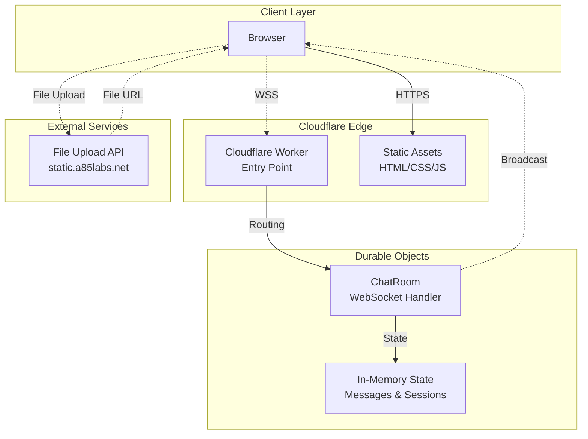

# Anonymous Chat

<div align="center">

[](https://workers.cloudflare.com/)
[](https://developer.mozilla.org/en-US/docs/Web/API/WebSocket)
[](https://tailwindcss.com/)
[](https://opensource.org/licenses/MIT)

완전 익명 실시간 채팅 애플리케이션  
Cloudflare Workers 기반 서버리스 아키텍처

[문서](#목차) · [버그 제보](https://github.com/gguatit/Anonymous_Chat/issues)

</div>

---

## 목차

- [주요 기능](#주요-기능)
- [프로젝트 개요](#프로젝트-개요)
- [아키텍처](#아키텍처)
- [빠른 시작](#빠른-시작)
- [보안 기능](#보안-기능)
- [플랫폼 호환성](#플랫폼-호환성)
- [고급 설정](#고급-설정)
- [테스트](#테스트)
- [배포](#배포)
- [문제 해결](#문제-해결)
- [기여](#기여)
- [라이선스](#라이선스)

---

## 프로젝트 개요

**완전 익명성 · 데이터 무보관 · 서버리스 · 오픈소스**

현대의 채팅 서비스는 대부분 사용자 데이터를 수집하고 저장합니다. 이 프로젝트는 다릅니다:

- 회원가입 불필요 (닉네임도 필요 없음)
- 메시지 영구 보관 안 함 (12시간 후 자동 삭제)
- 엣지 컴퓨팅 (Cloudflare 전 세계 데이터센터에서 실행)
- 저지연 (가까운 서버에서 응답, 평균 <50ms)
- 무료 호스팅 (Cloudflare Workers Free Tier 활용)

---

## 주요 기능

### 실시간 채팅

- WebSocket 기반 양방향 통신
- 평균 지연시간 <100ms
- 자동 재연결 (지수적 백오프)
- 타이핑 표시 실시간 동기화
- 메시지 수정 및 삭제 (10분 제한)
- **파일 공유** (이미지, 비디오, 오디오, 문서)

### 파일 공유 시스템

- 최대 100MB 파일 업로드
- 지원 형식: 이미지, 비디오, 오디오, PDF, 문서
- 실시간 업로드 진행 상태 표시
- 이미지 인라인 미리보기
- 비디오/오디오 스트리밍 재생
- 외부 API 서버 연동 (static.a85labs.net)

### 완전 익명

- 회원가입 및 로그인 불필요
- 닉네임 없는 익명 채팅
- 세션 기반 식별만 사용
- IP 주소 저장 안 함

### 임시 메시지 저장

- 최대 500개 메시지 저장
- 12시간 후 자동 삭제
- 입장 시 최근 50개 메시지 제공
- 메모리 내 저장 (DB 없음)

### 강력한 보안

- Rate Limiting (1초당 1개, 분당 30개)
- IP당 최대 5개 동시 연결
- XSS/CSRF 공격 방어
- HMAC-SHA256 메시지 서명
- Content Security Policy (CSP)

### 현대적인 UI/UX

- 다크 테마 (눈의 피로 감소)
- 반응형 디자인 (모바일/데스크톱)
- Tailwind CSS 기반
- 접근성 (ARIA) 준수
- 부드러운 애니메이션
- URL 자동 링크 및 이미지 프리뷰

### 모니터링

- 실시간 접속자 수 표시
- 연결 상태 인디케이터
- 익명 메트릭 API
- Wrangler tail 로그 지원

### 관리자 대시보드

- 보안 인증 기반 접근 (`/administrator`)
- 실시간 통계 및 모니터링
- **활성 세션 관리 및 IP 기반 차단**
  - 사용자 강제 퇴장 (즉시 퇴장, 30초, 5분, 10분 차단)
  - 외부 IP 기반 차단으로 네트워크 공유 사용자 보호
  - 클릭 한 번으로 차단 시간 선택
- **메시지 관리**
  - 관리자 메시지 시간 제한 없이 수정/삭제 가능
  - 줄바꿈 지원 (Shift+Enter)
- **실시간 활동 모니터링**
  - 사용자별 마지막 활동 시간 추적
  - 온라인 상태 실시간 표시
- **시스템 공지사항**
  - 일반 메시지와 강조 공지사항 전송
  - 공지는 12시간 후에도 유지 (새 공지로 대체될 때까지)
  - 신규 접속자도 현재 공지 자동 수신
- **데이터 내보내기**
  - CSV 내보내기 (전체, 활성 세션, 오늘, 1시간, 24시간 필터)
  - 사용자 세션 및 메시지 기록 포함
- JWT 기반 세션 관리
- IP 주소 추적 및 차단
- 감사 로그 및 시스템 정보

---

## 아키텍처


```mermaid
graph TB
    subgraph "Client Layer"
        A[Browser]
    end
    
    subgraph "Cloudflare Edge"
        B[Cloudflare Worker<br/>Entry Point]
        C[Static Assets<br/>HTML/CSS/JS]
    end
    
    subgraph "Durable Objects"
        D[ChatRoom<br/>WebSocket Handler]
        E[In-Memory State<br/>Messages & Sessions]
    end
    
    subgraph "External Services"
        F[File Upload API<br/>static.a85labs.net]
    end
    
    A -->|HTTPS| C
    A -.->|WSS| B
    A -.->|File Upload| F
    B -->|Routing| D
    D -->|State| E
    D -.->|Broadcast| A
    F -.->|File URL| A
```

### 데이터 흐름

```plaintext
1. 클라이언트 → HTTP(S) → Static Assets (HTML/CSS/JS)
2. WebSocket → WSS → Worker → IP 검증 → Durable Object
3. 메시지 → 클라이언트 검증 → 서버 검증 → 브로드캐스트
4. 타이핑 → 2초 디바운싱 → 다른 클라이언트에게 전파
5. 파일 업로드 → static.a85labs.net → 파일 URL 반환 → 메시지에 첨부
```

### 핵심 컴포넌트

| 컴포넌트 | 역할 | 위치 |
|---------|------|------|
| Cloudflare Worker | HTTP/WebSocket 진입점, 라우팅 | `src/worker.js` |
| Durable Object | 채팅방 상태 관리, 메시지 브로드캐스트 | `src/worker.js` (ChatRoom) |
| Static Assets | HTML, CSS, JavaScript 정적 파일 | `public/` |
| Client App | WebSocket 클라이언트, UI 렌더링 | `public/js/` |
| File Upload Manager | 파일 업로드 및 미리보기 처리 | `public/js/file-upload.js` |
| External File API | 파일 저장 및 제공 | `static.a85labs.net` |

---

## 빠른 시작

### 사전 요구사항

| 도구 | 버전 | 설치 방법 |
|------|------|-----------|
| Node.js | 18+ | [nodejs.org](https://nodejs.org/) |
| npm | 9+ | Node.js와 함께 설치됨 |
| Wrangler CLI | 최신 | `npm install -g wrangler` |
| Cloudflare 계정 | - | [dash.cloudflare.com](https://dash.cloudflare.com/) |

### 1분 안에 시작하기

```bash
# 1. 저장소 클론
git clone https://github.com/gguatit/Anonymous_Chat.git
cd Anonymous_Chat

# 2. 의존성 설치
npm install

# 3. Cloudflare 로그인
wrangler login

# 4. 필수 시크릿 설정 (관리자 기능 사용 시)
npx wrangler secret put ADMIN_ID
# 프롬프트에서 관리자 ID 입력 (예: admin)

npx wrangler secret put ADMIN_PASSWORD
# 프롬프트에서 관리자 비밀번호 입력

npx wrangler secret put HMAC_SECRET
# 프롬프트에서 HMAC 시크릿 키 입력 (32자 이상 권장)

# 5. 로컬 개발 서버 시작
npm run dev

# 브라우저에서 http://localhost:8787 접속
# 관리자 페이지: http://localhost:8787/administrator
```

**참고:** 로컬 개발 시 시크릿이 설정되지 않으면 기본값이 사용됩니다 (개발용, ID: 비공개, Password: 비공개). 프로덕션 환경에서는 반드시 시크릿을 설정해야 합니다.

### 커스터마이징

<details>
<summary><b>색상 테마 변경</b></summary>

`public/index.html`의 Tailwind 설정 수정:

```javascript
tailwind.config = {
    darkMode: 'class',
    theme: {
        extend: {
            colors: {
                primary: '#your-color',
            }
        }
    }
}
```

</details>

<details>
<summary><b>메시지 제한 변경</b></summary>

`src/worker.js`에서 상수 수정:

```javascript
const RATE_LIMIT = {
    MAX_MESSAGES_PER_MINUTE: 30,  // 분당 메시지 수
    MAX_CONNECTIONS_PER_IP: 5,    // IP당 동시 연결
    MESSAGE_COOLDOWN: 1000,        // 메시지 간 쿨다운 (ms)
};
```

</details>

<details>
<summary><b>IP 차단/화이트리스트 설정</b></summary>

`src/worker.js`에서 설정:

```javascript
const SECURITY = {
    MAX_MESSAGE_LENGTH: 5000,
    BANNED_IPS: new Set([
        '192.168.1.1',
        '10.0.0.1'
    ]),
    IP_WHITELIST: null,  // null = 모든 IP 허용
};
```

</details>

---

## 보안 기능

### 다층 보안 아키텍처

```
Layer 1: Cloudflare Network
├── DDoS 보호
├── 자동 SSL/TLS
└── 글로벌 WAF

Layer 2: Worker (Entry Point)
├── IP 기반 접근 제어
├── Origin 헤더 검증
└── Rate Limiting

Layer 3: Durable Object
├── 세션 검증
├── HMAC 메시지 서명
└── 입력 Sanitization

Layer 4: Client
├── XSS 방지 (textContent)
├── CSP (Content Security Policy)
└── 지수적 백오프
```

### 구현된 보안 기능

<details>
<summary><b>1. MITM (중간자 공격) 방어</b></summary>

#### HTTPS/WSS 강제

- 모든 HTTP 요청 → HTTPS 리다이렉트
- WebSocket은 WSS(Secure WebSocket)만 사용
- HSTS 헤더로 브라우저 강제 (1년)

```javascript
// HTTP → HTTPS 리다이렉트
if (url.protocol === 'http:' && !url.hostname.includes('localhost')) {
    return Response.redirect(`https://${url.hostname}${url.pathname}`, 301);
}
```

#### HSTS 설정

```
Strict-Transport-Security: max-age=31536000; includeSubDomains; preload
```

</details>

<details>
<summary><b>2. 데이터 변조 방지</b></summary>

#### HMAC-SHA256 메시지 서명

- 클라이언트: 전송 전 HMAC 서명 생성
- 서버: 수신 시 서명 검증
- 변조된 메시지는 자동 거부

```javascript
// 서명 생성 (클라이언트/서버)
const signature = await generateMessageSignature(content, sessionId, timestamp);

// 서명 검증 (서버)
const isValid = await verifyMessageSignature(data);
```

#### 세션 ID 검증

- WebSocket 연결 시 할당된 세션 ID와 메시지의 세션 ID 일치 확인
- 타인의 세션 ID 도용 불가능

</details>

<details>
<summary><b>3. CSRF (Cross-Site Request Forgery) 방어</b></summary>

#### Origin 헤더 검증

```javascript
const ALLOWED_ORIGINS = [
    'https://kalpha.mmv.kr',           // 프로덕션
    'http://localhost:8787'             // 개발
];

// WebSocket 연결 시 Origin 검증
if (origin && !isAllowedOrigin(origin)) {
    return new Response('Unauthorized Origin', { status: 403 });
}
```

</details>

<details>
<summary><b>4. XSS (Cross-Site Scripting) 방어</b></summary>

#### 서버 측 Sanitization

```javascript
sanitizeInput(input) {
    return input.replace(/[\x00-\x1F\x7F]/g, '').trim();
}
```

#### 클라이언트 측 안전 렌더링

```javascript
// 위험: innerHTML 사용 금지
// element.innerHTML = userInput;

// 안전: textContent 사용
element.textContent = userInput;
```

#### Content Security Policy (CSP)

```
default-src 'self';
script-src 'self' https://cdn.tailwindcss.com;
connect-src 'self' wss: ws:;
object-src 'none';
```

</details>

<details>
<summary><b>5. Rate Limiting</b></summary>

#### 3단계 제한

1. **메시지 쿨다운**: 1초당 1개
2. **분당 제한**: 30개
3. **IP당 연결**: 최대 5개

```javascript
// 클라이언트 측
if (Date.now() - lastMessageTime < 1000) {
    showError('메시지를 너무 빠르게 전송하고 있습니다');
    return;
}

// 서버 측
if (messagesThisMinute >= MAX_MESSAGES_PER_MINUTE) {
    ws.send(JSON.stringify({
        type: 'error',
        message: '분당 메시지 제한 초과'
    }));
    return;
}
```

</details>

<details>
<summary><b>6. DoS/DDoS 방어</b></summary>

- Cloudflare의 네트워크 레벨 DDoS 보호
- IP당 동시 연결 수 제한
- 지수적 백오프 재연결 (최대 10회)
- 메시지 크기 제한 (1000자)

</details>

### 보안 감사 체크리스트

- [x] HTTPS/WSS 강제
- [x] HSTS 헤더 설정
- [x] CSP 헤더 설정
- [x] Origin 검증
- [x] HMAC 메시지 서명
- [x] XSS 방어 (sanitization)
- [x] CSRF 방어
- [x] Rate Limiting
- [x] 입력 검증
- [x] 세션 관리
- [x] IP 기반 접근 제어
- [x] 메시지 크기 제한
- [x] 연결 수 제한

---

## 플랫폼 호환성

### 완전 지원 (테스트 완료)

| 플랫폼 | 버전 | 상태 | 비고 |
|--------|------|------|------|
| Windows | 11 | ✅ | 모든 기능 정상 작동 |
| Arch Linux | Latest | ✅ | 모든 기능 정상 작동 |
| Ubuntu | 20.04+ | ✅ | 모든 기능 정상 작동 |
| Garuda Linux | Latest | ✅ | 모든 기능 정상 작동 |
| Android | 16 | ✅ | 모든 기능 정상 작동 |

### 미지원 (테스트 안 됨)

| 플랫폼 | 상태 | 비고 |
|--------|------|------|
| iOS | ❌ | 테스트되지 않음 |
| macOS | ❌ | 테스트되지 않음 |

### 권장 환경

데스크톱 및 모바일 모두 완벽하게 지원됩니다.  
Windows, Linux, Android에서 최상의 경험을 제공합니다.

---

## 고급 설정

### 환경 변수 및 시크릿

`wrangler.toml` 설정:

```toml
[env.production]
vars = { ENVIRONMENT = "production" }

[env.development]
vars = { ENVIRONMENT = "development" }
```

### 필수 시크릿 설정

프로덕션 환경에서 반드시 설정해야 하는 시크릿:

```bash
# 관리자 ID 설정
npx wrangler secret put ADMIN_ID
# 예시: admin, kalpha 등

# 관리자 비밀번호 설정
npx wrangler secret put ADMIN_PASSWORD
# 강력한 비밀번호 사용 권장 (12자 이상, 특수문자 포함)

# HMAC 시크릿 키 설정
npx wrangler secret put HMAC_SECRET
# 32자 이상의 랜덤 문자열 사용
# 생성 예시: openssl rand -base64 32
```

**보안 주의사항:**
- 시크릿은 절대 코드에 하드코딩하지 마세요
- 시크릿은 Cloudflare에 암호화되어 저장됩니다
- 정기적으로 비밀번호를 변경하세요
- `wrangler.toml` 파일에 시크릿을 포함하지 마세요

자세한 내용은 [SECURITY_SETUP.md](SECURITY_SETUP.md)를 참조하세요.

### 프로젝트 구조

```plaintext
Anonymous_Chat/
├── public/                # 정적 파일 (Cloudflare Assets)
│   ├── index.html        # 메인 HTML
│   ├── administrator.html # 관리자 대시보드
│   ├── js/               # 클라이언트 JavaScript
│   │   ├── chat.js       # 메인 진입점
│   │   ├── websocket.js  # WebSocket 클라이언트
│   │   ├── session.js    # 세션 관리
│   │   ├── ui.js         # UI 렌더링
│   │   ├── file-upload.js # 파일 업로드 관리
│   │   └── admin.js      # 관리자 페이지 로직
│   ├── css/              # 스타일시트
│   │   ├── base.css      # 기본 스타일
│   │   └── animations.css # 애니메이션
│   ├── ico/              # 아이콘 파일들
│   ├── manifest.json     # PWA Manifest
│   ├── _headers          # Cloudflare 보안 헤더
│   └── _redirects        # 리다이렉트 규칙
├── functions/            # Cloudflare Pages Functions
│   └── _middleware.js    # 미들웨어 (보안 헤더)
├── src/                  # Worker 소스
│   └── worker.js         # Worker + Durable Object + Admin API
├── test/                 # 테스트 파일
│   ├── worker.test.js    # Worker 테스트
│   ├── security.test.js  # 보안 테스트
│   ├── message-edit.test.js # 메시지 수정 테스트
│   ├── message-delete.test.js # 메시지 삭제 테스트
│   └── link-preview.test.js # 링크 프리뷰 테스트
├── package.json          # 프로젝트 설정
├── wrangler.toml         # Cloudflare 설정
├── vitest.config.js      # 테스트 설정
├── deploy.sh             # 배포 스크립트
├── ADMIN_GUIDE.md        # 관리자 가이드
├── SECURITY_SETUP.md     # 보안 설정 가이드
├── SECURITY_VERIFICATION.md # 보안 검증 가이드
└── FEATURE_IDEAS.md      # 기능 아이디어
```

### API 엔드포인트

#### 공개 API

| 엔드포인트 | 메서드 | 설명 |
|-----------|--------|------|
| `/ws` | GET (WebSocket) | WebSocket 연결 |
| `/health` | GET | 헬스 체크 |
| `/metrics` | GET | 익명 메트릭 (연결 수, 메시지 수) |
| `/` | GET | 정적 파일 (HTML) |
| `/administrator` | GET | 관리자 대시보드 |

#### 관리자 API (인증 필요)

| 엔드포인트 | 메서드 | 설명 |
|-----------|--------|------|
| `/api/admin/login` | POST | 관리자 로그인 (JWT 발급) |
| `/api/admin/verify` | POST | JWT 토큰 검증 |
| `/api/admin/metrics` | GET | 상세 통계 조회 |
| `/api/admin/sessions` | GET, DELETE | 활성 세션 관리 |
| `/api/admin/messages` | GET, DELETE | 메시지 조회 및 삭제 |
| `/api/admin/edit-message` | POST | 관리자 메시지 수정 (시간 제한 없음) |
| `/api/admin/delete-message` | POST | 관리자 메시지 삭제 (시간 제한 없음) |
| `/api/admin/kick-user` | POST | 사용자 강제 퇴장 및 IP 차단 |
| `/api/admin/announce` | POST | 시스템 공지사항 전송 |
| `/api/admin/broadcast` | POST | 관리자 메시지 브로드캐스트 |
| `/api/admin/logs` | GET | 감사 로그 조회 |

#### 보안 API

| 엔드포인트 | 메서드 | 설명 |
|-----------|--------|------|
| `/api/check-ban` | GET | IP 차단 상태 확인 |
| `/api/admin/logs` | GET | 감사 로그 조회 |
| `/api/admin/logout` | POST | 로그아웃 (토큰 무효화) |

#### 파일 업로드 API (static.a85labs.net)

| 엔드포인트 | 메서드 | 설명 |
|-----------|--------|------|
| `/upload` | POST | 파일 업로드 (multipart/form-data) |
| `/{id}/{name}` | GET | 업로드된 파일 다운로드 |
| `/{id}/{name}` | HEAD | 파일 메타데이터 조회 |

#### 메트릭 API 응답 예시

```json
{
  "timestamp": 1699264800000,
  "activeConnections": 42,
  "totalMessages": 1337,
  "uptime": 86400
}
```

#### 파일 업로드 응답 예시

```json
{
  "id": "abc123xyz",
  "name": "image.jpg",
  "url": "https://static.a85labs.net/abc123xyz/image.jpg"
}
```

---

## 테스트

### 단위 테스트 실행

```bash
# 모든 테스트 실행
npm test

# Watch 모드 (파일 변경 감지)
npm run test:watch

# 커버리지 리포트
npm run test:coverage
```

### 로컬 테스트

```bash
# 로컬 개발 서버 시작
npm run dev

# Wrangler tail로 실시간 로그 확인
wrangler tail
```

### E2E 테스트 (수동)

1. **연결 테스트**: 브라우저 개발자 도구 → 네트워크 탭 → WebSocket 연결 확인
2. **메시지 전송**: 메시지 입력 후 다른 브라우저에서 수신 확인
3. **Rate Limiting**: 1초에 2개 이상 메시지 전송 시도 → 에러 확인
4. **재연결**: 네트워크 연결 끊기 → 자동 재연결 확인

---

## 배포

### 방법 1: 자동 배포 스크립트 (권장)

```bash
# 실행 권한 부여 (최초 1회)
chmod +x deploy.sh

# 배포 실행
./deploy.sh
```

자동으로 다음을 수행:

- Wrangler 설치 확인
- 인증 상태 확인
- Worker + Assets 배포
- 배포 URL 표시

### 방법 2: npm 스크립트

```bash
# 프로덕션 배포
npm run deploy

# 개발 환경 배포
npm run deploy:dev
```

### 방법 3: GitHub Actions (CI/CD)

`.github/workflows/deploy.yml` 생성:

```yaml
name: Deploy to Cloudflare

on:
  push:
    branches: [main]

jobs:
  deploy:
    runs-on: ubuntu-latest
    permissions:
      contents: read
      deployments: write
    name: Deploy to Cloudflare Workers
    steps:
      - uses: actions/checkout@v4
      
      - name: Setup Node.js
        uses: actions/setup-node@v4
        with:
          node-version: '18'
      
      - name: Install dependencies
        run: npm ci
      
      - name: Run tests
        run: npm test
      
      - name: Deploy
        uses: cloudflare/wrangler-action@v3
        with:
          apiToken: ${{ secrets.CLOUDFLARE_API_TOKEN }}
          accountId: ${{ secrets.CLOUDFLARE_ACCOUNT_ID }}
          command: deploy --env production
```

**필요한 GitHub Secrets:**

- `CLOUDFLARE_API_TOKEN`: Cloudflare API 토큰
- `CLOUDFLARE_ACCOUNT_ID`: Cloudflare 계정 ID

### 배포 후 확인

```bash
# 실시간 로그 확인
wrangler tail

# 메트릭 확인
curl https://your-worker.workers.dev/metrics

# 헬스 체크
curl https://your-worker.workers.dev/health
```

### 롤백

```bash
# 이전 배포 버전 목록 확인
wrangler deployments list

# 특정 버전으로 롤백
wrangler rollback [deployment-id]
```

---

## 문제 해결

<details>
<summary><b>WebSocket 연결이 안 돼요</b></summary>

**원인:**

- Durable Objects 미활성화
- Origin 헤더 불일치
- IP 차단 목록에 포함

**해결:**

1. Cloudflare Dashboard → Workers & Pages → Durable Objects 활성화 확인
2. `src/worker.js`의 `ALLOWED_ORIGINS`에 도메인 추가
3. `BANNED_IPS`에서 IP 제거

</details>

<details>
<summary><b>메시지가 전송되지 않아요</b></summary>

**원인:**

- Rate Limiting 제한 (1초당 1개)
- 메시지 길이 초과 (1000자)
- 세션 만료

**해결:**

1. 1초 이상 간격을 두고 메시지 전송
2. 메시지 길이 1000자 이하로 줄이기
3. 페이지 새로고침 (새 세션 생성)

</details>

<details>
<summary><b>"Rate limit exceeded" 에러가 나요</b></summary>

**원인:**

- 1분에 30개 이상 메시지 전송
- IP당 5개 이상 동시 연결

**해결:**

1. 잠시 대기 (1분 후 자동 해제)
2. 불필요한 브라우저 탭 닫기
3. `src/worker.js`에서 `RATE_LIMIT` 값 조정 (필요시)

</details>

<details>
<summary><b>배포 시 "Unauthorized" 에러가 나요</b></summary>

**원인:**

- Wrangler 인증 만료
- API 토큰 권한 부족

**해결:**

```bash
# 재로그인
wrangler logout
wrangler login

# API 토큰 권한 확인 (Workers 편집 권한 필요)
```

</details>

<details>
<summary><b>CORS 에러가 발생해요</b></summary>

**원인:**

- Origin 검증 실패

**해결:**

`src/worker.js`에서 도메인 추가:

```javascript
const ALLOWED_ORIGINS = [
    'https://your-domain.com',
    'https://kalpha.mmv.kr',
    'http://localhost:8787'
];
```

</details>

---

## 성능 최적화

### 달성된 성능 지표

| 지표 | 값 | 설명 |
|------|-----|------|
| 첫 바이트까지의 시간 (TTFB) | <50ms | Cloudflare Edge에서 응답 |
| WebSocket 레이턴시 | <100ms | 평균 메시지 전송 시간 |
| 동시 연결 | 1000+ | Durable Object당 |
| 메시지 처리량 | 10,000+/s | 초당 처리 가능 메시지 수 |
| 콜드 스타트 | ~50ms | Worker 초기 실행 시간 |

### 최적화 기법

- **엣지 컴퓨팅**: 사용자와 가장 가까운 Cloudflare 데이터센터에서 실행
- **WebSocket 연결 풀링**: Durable Objects로 연결 재사용
- **지연 로딩**: 초기 로드 시 필수 리소스만 로드
- **메시지 배칭**: 여러 메시지를 한 번에 브로드캐스트
- **메모리 관리**: 오래된 메시지 자동 정리 (12시간, 500개 제한)

---

## 기여

기여를 환영합니다! 다음 단계를 따라주세요:

### 개발 워크플로우

1. **Fork** 이 저장소
2. **Clone** 포크한 저장소

   ```bash
   git clone https://github.com/YOUR_USERNAME/Anonymous_Chat.git
   cd Anonymous_Chat
   ```

3. **Branch** 생성

   ```bash
   git checkout -b feature/amazing-feature
   ```

4. **Commit** 변경사항

   ```bash
   git commit -m 'feat: Add amazing feature'
   ```

5. **Push** to branch

   ```bash
   git push origin feature/amazing-feature
   ```

6. **Pull Request** 생성

### 커밋 컨벤션

[Conventional Commits](https://www.conventionalcommits.org/) 사용:

```
feat: 새로운 기능 추가
fix: 버그 수정
docs: 문서 변경
style: 코드 포맷팅 (기능 변경 없음)
refactor: 리팩토링
test: 테스트 추가/수정
chore: 빌드/설정 변경
```

### 코드 스타일

- **JavaScript**: ESLint + Prettier
- **들여쓰기**: 4 spaces
- **세미콜론**: 사용
- **따옴표**: 작은따옴표 (')

---

## 라이선스

이 프로젝트는 **MIT License**로 배포됩니다.

```
MIT License

Copyright (c) 2024 gguatit

Permission is hereby granted, free of charge, to any person obtaining a copy
of this software and associated documentation files (the "Software"), to deal
in the Software without restriction, including without limitation the rights
to use, copy, modify, merge, publish, distribute, sublicense, and/or sell
copies of the Software, and to permit persons to whom the Software is
furnished to do so, subject to the following conditions:

The above copyright notice and this permission notice shall be included in all
copies or substantial portions of the Software.

THE SOFTWARE IS PROVIDED "AS IS", WITHOUT WARRANTY OF ANY KIND, EXPRESS OR
IMPLIED, INCLUDING BUT NOT LIMITED TO THE WARRANTIES OF MERCHANTABILITY,
FITNESS FOR A PARTICULAR PURPOSE AND NONINFRINGEMENT. IN NO EVENT SHALL THE
AUTHORS OR COPYRIGHT HOLDERS BE LIABLE FOR ANY CLAIM, DAMAGES OR OTHER
LIABILITY, WHETHER IN AN ACTION OF CONTRACT, TORT OR OTHERWISE, ARISING FROM,
OUT OF OR IN CONNECTION WITH THE SOFTWARE OR THE USE OR OTHER DEALINGS IN THE
SOFTWARE.
```

자유롭게 사용, 수정, 배포 가능합니다.

---

## 크레딧

### 기술 스택

- [Cloudflare Workers](https://workers.cloudflare.com/) - 서버리스 컴퓨팅
- [Durable Objects](https://developers.cloudflare.com/durable-objects/) - 상태 관리
- [Tailwind CSS](https://tailwindcss.com/) - CSS 프레임워크
- [Vitest](https://vitest.dev/) - 테스트 프레임워크

### 영감

이 프로젝트는 개인정보 보호와 익명성의 중요성에서 영감을 받았습니다.

---

## 지원 및 문의

<div align="center">

[](https://github.com/gguatit/Anonymous_Chat/issues)
[](https://github.com/gguatit/Anonymous_Chat/discussions)

[이슈 생성하기](https://github.com/gguatit/Anonymous_Chat/issues/new)

</div>

---

<div align="center">

이 프로젝트가 도움이 되었다면 ⭐️ 별표를 눌러주세요!

Made with Cloudflare Workers and Pages

[맨 위로](#anonymous-chat)

</div>
