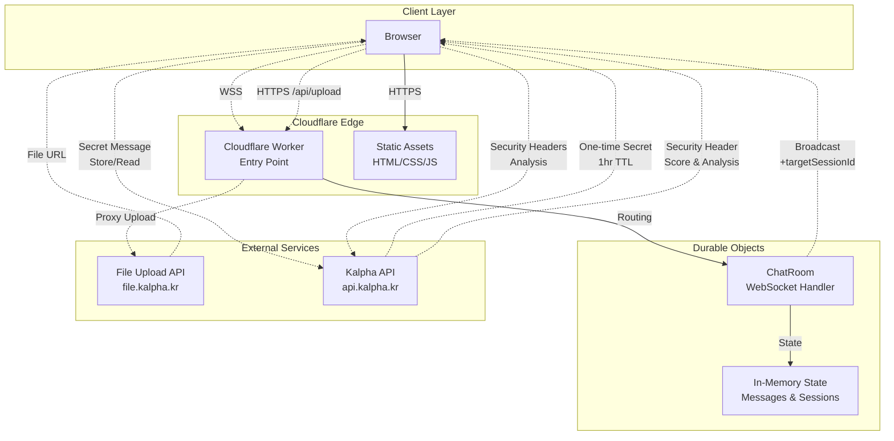

# Anonymous Chat

<div align="center">


```text
    _                                                      
   / \   _ __   ___  _ __  _   _ _ __ ___   ___  _   _ ___ 
  / _ \ | '_ \ / _ \| '_ \| | | | '_ ` _ \ / _ \| | | / __|
 / ___ \| | | | (_) | | | | |_| | | | | | | (_) | |_| \__ \
/_/   \_\_| |_|\___/|_| |_|\__, |_| |_| |_|\___/ \__,_|___/
                           |___/                           
```

[](https://workers.cloudflare.com/)
[](https://developer.mozilla.org/en-US/docs/Web/API/WebSocket)
[](https://tailwindcss.com/)
[](https://www.gnu.org/licenses/agpl-3.0)

실시간 익명채팅 애플리케이션  
Cloudflare Workers 기반 서버리스 아키텍처

[문서](#목차) · [버그 제보](https://github.com/gguatit/Anonymous_Chat/issues)

</div>

---

## 목차

- [최근 업데이트](#최근-업데이트)
- [주요 기능](#주요-기능)
- [프로젝트 개요](#프로젝트-개요)
- [아키텍처](#아키텍처)
- [빠른 시작](#빠른-시작)
- [보안 기능](#보안-기능)
- [플랫폼 호환성](#플랫폼-호환성)
- [고급 설정](#고급-설정)
- [테스트](#테스트)
- [배포](#배포)
- [문제 해결](#문제-해결)
- [기여](#기여)
- [라이선스](#라이선스)

---

## 최근 업데이트

> 전체 변경 이력은 [CHANGELOG.md](CHANGELOG.md)를 참조하세요.

### 2026년 5월 18일 - 코드 안정화 및 보안 강화

#### 버그 수정 (Critical)
- **Storage 쓰기 누락 방지**: 메시지 전송/수정/삭제 시 DO storage에 `await` 추가 → eviction 시 데이터 소실 방지
- **재접속 close-race 수정**: reconnect 시 이전 WebSocket close 이벤트가 새 세션을 삭제하는 버그 수정
- **레이트 리밋 윈도우 버그 수정**: 입장 1분 경과 후 분당 메시지 제한이 영구 해제되는 버그 수정 (슬라이딩 윈도우 방식으로 교체)

#### 긴급공지 시스템
- 관리자가 긴급공지 발송 → 모든 사용자 공지사항 페이지로 강제 리다이렉션
- 긴급공지 수신 시 10초 최소 체류 후 채팅 복귀 가능, 동일 공지 1회만 리다이렉션
- 긴급공지 해제 시 WebSocket + 폴링으로 자동 채팅 복귀
- 관리자 패널: 메시지/공지 입력 구역 분리, 긴급공지 체크박스 + 만료시간 설정

#### D1 로그 시스템 개편
- 로그 테이블 3개 분리: `admin_activity_logs`, `audit_logs`, `error_logs`
- 감사 로그·오류 로그를 DO Storage → D1으로 이전, 로그 삭제 시 즉시 DB 반영

#### 보안 강화
- **메시지 서명 검증 강제화**: 서명 없는 메시지 거부 (기존: 서명 필드 없으면 검증 생략)
- **API 레이트 리밋 확대**: `/api/config`, `/api/upload`, `/api/push/*`, `/metrics`, `/health` 등 취약 엔드포인트 보호
- **클라이언트 XSS 방지**: 파일 업로드 미리보기에서 파일명 HTML escaping 적용
- **Error forward 헤더 필터링**: client error 전달 시 safe header만 전송
- **sessionId 검증**: WebSocket 연결 전 길이 및 허용 문자 검증 추가

#### 코드 품질 개선
- **Magic number 상수화**: 25개 하드코딩 값 → `constants.js` 중앙화
- **중복 코드 제거**: `sanitizeInput` 통합, 채널 핸들러 통합, 세션 목록 빌더 추출
- **죽은 WebSocket 정리**: `broadcast()`/`sendToSession()` send 실패 시 세션 자동 정리
- **Dead code 제거**: 사용되지 않는 함수 및 상수 제거
- **ESLint 강화**: `no-unused-vars` → error, `no-eval` 추가, 복잡도 경고 도입

#### 인프라
- **`.dev.vars.example` 완성**: 누락된 환경변수 6종 문서화
- **파일 업로드 URL 환경변수화**: `FILE_UPLOAD_URL` 추가, `file.kalpha.kr` 연동 (250MB 지원)

### 2026년 4월 29일 - 채널 시스템 추가

#### 새로운 기능
- **채널 시스템**: 익명 채팅방 내에서 별도의 채널 생성/참가 가능
  - 빈 공간 우클릭 → "채널 추가" / "채널 참가" 메뉴
  - 채널 이름(slug) 기반: 생성 시 이름 입력 → 동일 이름으로 참가
  - 채널에 사람이 없으면 10분 후 자동 삭제
  - 메인룸 외 무제한 채널 생성 가능 (각 채널별 독립된 Durable Object)
  - 관리자 페이지에서 채널 목록 확인, 상세 정보(접속자/메시지), 강제 삭제 가능
  - 관리자 삭제 시 해당 채널 사용자 자동 메인 채널 이동

#### 아키텍처 변경
- `ChannelRegistry` Durable Object 신규: 채널 메타데이터 중앙 관리
- `ChatRoom` DO 동적 라우팅: `?channel=slug` 파라미터로 채널별 DO 인스턴스 생성
- 채널 메시지는 푸시 알림 비활성화 (메인룸만 알림)

---

### 2026년 4월 28일 - OG Link Preview, 코드 품질 개선, 버그 수정

#### 새로운 기능
- **OG Link Preview**: 채팅 내 URL 아래에 제목·설명·이미지 카드 자동 표시
  - Worker가 외부 URL fetch → OG 태그 파싱 (`POST /api/preview`)
  - Cloudflare Edge Cache (1시간), 클라이언트 메모리 캐시 (중복 요청 방지)
  - Rate limit 적용 (IP당 10초 5회), 5초 타임아웃
  - 이미지 URL, 비-HTML 리소스는 프리뷰 제외

#### 버그 수정
- **WebSocket 재연결 시 "입장했습니다" 중복 출력 수정**: 연결 종료 시 세션 메타데이터를 유지하여 재연결을 새 접속으로 오인하지 않음
- **search.js 메서드 중복 정의 수정**: `syncTagsFromInput()` 2중 선언으로 인한 로직 무효화 버그 제거
- **delete-audit-logs 관리자 API 인증 누락 패치**

#### 코드 품질 개선
- **공통 유틸 모듈 통합**: `escapeHtml`/`isValidUrl`/`formatFileSize` 등 5개 파일 중복 제거
- **Worker 라우트 테이블 도입**: 35개 if-chain을 선언적 배열로 리팩토링
- **인증 미들웨어 도입**: admin.js 17개 핸들러 auth boilerplate 통합 (140줄 감소)
- **DO 포워딩 헬퍼 도입**: `forwardToDO()`로 15개 핸들러 DO fetch 패턴 통일
- **ui.js 메시지 렌더링 중복 제거**: `displayMessage`/`displayBatchMessages` 공유 메서드 추출
- **레거시 코드 정리**: 사용하지 않는 `public/app.js` 제거
- **`errors` 메트릭 이중계산 수정**

#### 관리자 대시보드 개선
- **관리자 로그인 기록 탭**: KV 기반 로그인 성공/실패/차단/로그아웃 내역 실시간 표시
- **감사 로그 필터 버그 수정**: `delete_message` 필터 매핑 오류 수정, 누락 필터 3종 추가
- **감사 로그 CSV 낳고내기**: 버튼 클릭으로 감사 로그 CSV 다운로드
- **세션 목록**: 실제 WebSocket 상태(`isOnline`), 국가, User-Agent 표시
- **사용자 상세 모달**: 닉네임, 국가, User-Agent 추가, `lastMessage` 표시 버그 수정
- **에러 로그**: 타입별 필터 + 메시지 텍스트 검색

---

### 2026년 4월 21일 - Cloudflare Turnstile 인증 추가

#### 새로운 기능
- **Cloudflare Turnstile 봇 방지**: 채팅 접속 전 보안 인증 (봇이 아닌지 확인)
  - 세션당 1회 인증 (sessionStorage로 관리, 최대 4시간 유효)
  - 인증 완료 후 WebSocket 연결 및 채팅 접속 허용
  - 서버 사이드 토큰 검증 (`POST /api/turnstile/verify`)
  - CSP에 `challenges.cloudflare.com` (script-src, connect-src, frame-src) 추가

#### 서버 사이드 변경
- `POST /api/turnstile/verify` 엔드포인트 추가 (Cloudflare siteverify API 호출)
- `TURNSTILE_SECRET_KEY` 환경변수 필요 (`npx wrangler secret put TURNSTILE_SECRET_KEY`)

### 2026년 4월 15일 - 메시지 검색, 이미지 붙여넣기, URL 보안 헤더 분석 추가

#### 새로운 기능
- **메시지 검색**: 상단 돋보기 버튼 또는 `Ctrl+F`로 12시간 이내의 모든 메시지를 서버 사이드에서 검색. 내용, 닉네임, 파일명 다중 키워드 AND 검색 지원. 검색 결과 하이라이트 및 클릭 시 해당 메시지로 스크롤 이동. `#images`(이미지), `#files`(파일), `#code`(코드) 태그로 유형별 필터링 가능. 태그 버튼 클릭 또는 검색어에 직접 입력 지원
- **클립보드 이미지 붙여넣기**: `Ctrl+V`로 클립보드에 복사한 이미지를 채팅 입력창에 바로 붙여넣기. 파일명 자동 생성 및 업로드 미리보기 처리
- **URL 보안 헤더 분석**: 채팅 내 HTTP/HTTPS URL 옆에 방패 아이콘 표시. 클릭 시 Kalpha Security API(`GET /security/headers`)로 해당 사이트의 보안 헤더를 분석하여 점수·등급·헤더 상태·상세 분석 결과를 모달로 표시

#### 서버 사이드 변경
- `GET /api/search?q=검색어&limit=N` 엔드포인트 추가 (Durable Object 내 전체 메시지 대상 검색)
- `#images`, `#files`, `#code` 태그 필터링 서버 사이드 처리 및 `isLikelyCode()` 휴리스틱 코드 감지 추가
- 검색 응답에 `tags` 필드 추가 (이미지/파일/코드 자동 태깅)

---

## 프로젝트 개요

**완전 익명성 · 데이터 무보관 · 서버리스 · 오픈소스**

현대의 채팅 서비스는 대부분 사용자 데이터를 수집하고 저장합니다. 이 프로젝트는 다릅니다:

- 회원가입 불필요 (닉네임도 필요 없음)
- 메시지 영구 보관 안 함 (12시간 후 자동 삭제)
- 엣지 컴퓨팅 (Cloudflare 전 세계 데이터센터에서 실행)
- 저지연 (가까운 서버에서 응답, 평균 <50ms)
- 무료 호스팅 (Cloudflare Workers Free Tier 활용)

---

## 주요 기능

### 실시간 채팅

- WebSocket 기반 양방향 통신
- 평균 지연시간 <100ms
- 자동 재연결 (지수적 백오프)
- 타이핑 표시 실시간 동기화
- 메시지 수정 및 삭제 (10분 제한)
- **파일 공유** (이미지, 비디오, 오디오, 문서)
- **메시지 검색** (서버 사이드 다중 키워드 AND 검색, 내용/닉네임/파일명 대상)
- **태그 필터** (`#images`, `#files`, `#code`로 유형별 검색)
- **클립보드 이미지 붙여넣기** (Ctrl+V로 이미지 즉시 첨부)
- **URL 보안 헤더 분석** (채팅 내 URL 옆 방패 아이콘 클릭 시 Kalpha API로 보안 헤더 등급 산출)
- **OG Link Preview** (URL 아래 제목·설명·이미지 카드 자동 표시)

- **메시지 반응**: 6가지 이모지(👍❤️😂😮😢😡) 토글식 반응, 더블클릭으로 자동 👍 반응, 실시간 업데이트
- **AI 대화 요약**: `/summary`, `/topic`, `/mood`, `/conflict` 명령어로 Workers AI(llama-3-8b)가 대화를 분석 (4가지 모드: 종합요약/주제/분위기/논쟁, 15초 레이트 리밋, 세션ID 제거 후 처리)

### 채널 시스템 (Channel)

- **채널 생성/참가**: 채팅창 빈 공간 우클릭 → "채널 추가" / "채널 참가"
- **이름 기반 식별**: 채널 이름(slug)으로 생성하고 동일 이름으로 참가 (예: `kalpha`)
- **독립된 공간**: 각 채널별 별도의 Durable Object (메시지/세션/밴 완전 분리)
- **자동 삭제**: 접속자 0명 상태 10분 지속 시 자동 소멸
- **관리자 강제 삭제**: 관리자 페이지에서 채널 강제 삭제 가능, 삭제 시 사용자 자동 메인 채널 이동

### 파일 공유 시스템

- 최대 250MB 파일 업로드
- 지원 형식: 이미지, 비디오, 오디오, PDF, 문서
- 실시간 업로드 진행 상태 표시
- 이미지 인라인 미리보기
- 비디오/오디오 스트리밍 재생
- 외부 API 서버 연동 (file.kalpha.kr)

### 답장 및 비밀 메시지

- **메시지 답장**: 컨텍스트 메뉴(우클릭/길게 누르기)로 특정 메시지에 답장
- **비밀 메시지**: Dead Drop API 통합으로 일회성 비밀 메시지 전송
- **엄격한 접근 제어**: 비밀 메시지는 답장 보낸 사람과 받는 사람(targetSessionId)만 열람 가능
- **일회성 읽기**: 한 번 읽으면 영구 삭제 (1시간 TTL, 2000자 제한)
- **3자 보호**: 다른 사용자는 비밀 메시지 존재만 알 수 있고 내용은 볼 수 없음
- Dead Drop 제공: [api.kalpha.kr](https://api.kalpha.kr)

### 완전 익명 & 임시 닉네임

- 회원가입 및 로그인 불필요
- 닉네임 없는 익명 채팅 기본
- **임시 닉네임**: 세션 동안만 유지되는 1회성 닉네임 설정 가능
- **닉네임 잠금(Padlock)**: 기본 잠금 상태, 해제 시 사칭 방지 면책 모달 표시
- 세션 기반 식별만 사용

### 임시 메시지 저장

- 최대 500개 메시지 저장
- 12시간 후 자동 삭제
- 입장 시 최근 50개 메시지 제공
- 메모리 내 저장 (DB 없음)

### 강력한 보안

- Rate Limiting (1초당 1개, 분당 30개)
- IP당 최대 동시 연결 기기 제한
- XSS/CSRF 공격 방어
- HMAC-SHA256 메시지 서명
- Content Security Policy (CSP)
- Cloudflare Turnstile 봇 방지 (접속 전 인증)

### 현대적인 UI/UX

- 다크 테마 (눈의 피로 감소)
- **8가지 테마** (다크/라이트/미드나잇/오션/포레스트/아메시스트/선셋/사쿠라, 사쿠라 테마 벚꽃 파티클 효과)
- 반응형 디자인 (모바일/데스크톱)
- Tailwind CSS 기반
- 접근성 (ARIA) 준수
- 부드러운 애니메이션
- URL 자동 링크 및 이미지 프리뷰

### 모니터링 및 실시간 오류 추적

- 실시간 접속자 수 및 활성 세션 표시
- 연결 상태 인디케이터 (WebSocket Heartbeat)
- 🆕 **고급 오류 로깅 시스템**: 
  - 클라이언트 스크립트 에러 및 WebSocket 통신 오류를 포착하여 관리자 대시보드로 자동 전송
  - 사용자의 연결 IP, 유저 에이전트, 스택 트레이스를 서버 디스크(Durable Object Storage)에 영구 보존 기록
- 익명 메트릭 API 및 Wrangler tail 로그 자동 지원

### 관리자 대시보드

- 보안 인증 기반 접근 (`/administrator.html`)
- 실시간 통계, 오류 발생 횟수 및 시스템 환경 모니터링
- **활성 세션 관리 및 이중 차단 시스템**
  - 사용자 강제 퇴장 (즉시 퇴장, 30초, 5분, 10분 차단)
  - **IP + SessionID 이중 차단**: IP 변경해도 차단 우회 불가
  - 외부 IP 기반 차단으로 네트워크 공유 사용자 보호
  - 클릭 한 번으로 차단 시간 선택
  - **완전한 재접속 차단**:
    - 강퇴된 유저가 새로고침해도 차단 시간 동안 완전 접속 불가
    - SessionID가 자동 삭제되어 차단 우회 방지
    - IP와 SessionID 양쪽에서 동시 차단
- **메시지 관리**
  - **모든 메시지 삭제 권한**: 관리자는 일반 유저의 메시지와 첨부 파일도 삭제 가능
  - 관리자 메시지 시간 제한 없이 수정/삭제 가능
  - 줄바꿈 지원 (Shift+Enter)
  - 삭제 확인 메시지 및 감사 로그 기록
- **시스템 오류 내역 관리**
  - 최근 서버/클라이언트 단 100건 에러 열람
  - 타입별 필터링 및 메시지 내용 검색
  - 발생 환경 정보(User-Agent, 국가, URL) 및 상세 스택 트레이스 열람
  - 오류 로그 파일(.json) 다이렉트 다운로드 및 완전 초기화 지원
- **실시간 활동 모니터링**
  - 사용자별 마지막 활동 시간 추적
  - 실제 WebSocket 상태 기반 온라인 표시
  - 국가, User-Agent 등 세션 환경 정보 표시
- **시스템 공지사항**
  - 일반 메시지와 강조 공지사항 전송
  - 공지는 12시간 후에도 유지 (새 공지로 대체될 때까지)
  - 신규 접속자도 현재 공지 자동 수신
  - **공지사항 히스토리**: `/announcements.html` 페이지에서 모든 과거 공지 시간순 열람 가능
- **관리자 로그인 기록**
  - 로그인 성공/실패/차단/로그아웃 내역 실시간 조회
  - 브루트포스 공격 탐지 및 IP 추적
- **감사 로그**
  - CSV 내보내기 지원
  - 액션별 필터링
- **데이터 내보내기**
  - CSV 내보내기 (전체, 활성 세션, 오늘, 1시간, 24시간 필터)
  - 사용자 세션 및 메시지 기록 포함
- JWT 기반 세션 관리 및 내부 API 토큰(SSRF 방지) 검증

---

## 아키텍처


```mermaid
graph TB
    subgraph "Client Layer"
        A[Browser]
    end
    
    subgraph "Cloudflare Edge"
        B[Cloudflare Worker<br/>Entry Point]
        C[Static Assets<br/>HTML/CSS/JS]
    end
    
    subgraph "Durable Objects"
        D[ChatRoom<br/>WebSocket Handler]
        E[In-Memory State<br/>Messages & Sessions]
    end
    
    subgraph "External Services"
        F[File Upload API<br/>file.kalpha.kr]
        G[Kalpha API<br/>api.kalpha.kr]
    end
    
    A -->|HTTPS| C
    A -.->|WSS| B
    A -.->|HTTPS /api/upload| B
    A -.->|Secret Message<br/>Store/Read| G
    A -.->|Security Headers<br/>Analysis| G
    B -->|Routing| D
    B -.->|Proxy Upload| F
    D -->|State| E
    D -.->|Broadcast<br/>+targetSessionId| A
    F -.->|File URL| A
    G -.->|One-time Secret<br/>1hr TTL| A
    G -.->|Security Header<br/>Score & Analysis| A
```

### 데이터 흐름

```plaintext
1. 클라이언트 → HTTP(S) → Static Assets (HTML/CSS/JS)
2. Turnstile 인증 → Cloudflare siteverify API → 토큰 검증 → 세션 인증 완료
3. WebSocket → WSS → Worker → IP 검증 → Durable Object
4. 메시지 → 클라이언트 검증 → 서버 검증 → 브로드캐스트
5. 타이핑 → 2초 디바운싱 → 다른 클라이언트에게 전파
6. 파일 업로드 → Worker `/api/upload` 프록시 → file.kalpha.kr → 파일 URL 반환 → 메시지에 첨부
7. 비밀 메시지 저장 → Kalpha API (Dead Drop) → secretId 반환 → targetSessionId와 함께 브로드캐스트
8. 비밀 메시지 읽기 → targetSessionId 검증 → Kalpha API에서 일회성 조회 및 삭제
9. 보안 헤더 분석 → 채팅 내 URL 클릭 → Kalpha API (`/security/headers`) → 점수/등급/분석 결과 표시
10. 메시지 검색 → Worker `/api/search` → Durable Object 내 전체 메시지 검색 → 결과 반환
```

### 비밀 메시지 보안 흐름


```mermaid
sequenceDiagram
    participant A as 사용자 A
    participant B as 사용자 B
    participant C as 사용자 C (제3자)
    participant Chat as ChatRoom
    participant DD as Kalpha API

    Note over A,DD: 1. 답장 대상 선택 및 비밀 메시지 작성
    A->>A: 사용자 B의 메시지 우클릭
    A->>A: "비밀 메시지로 보내기" 체크
    
    Note over A,DD: 2. Dead Drop에 암호화 저장
    A->>DD: POST /store (메시지 내용)
    DD-->>A: secretId 반환
    
    Note over A,DD: 3. 메시지 브로드캐스트 (targetSessionId 포함)
    A->>Chat: 전송 { secretId, targetSessionId: B.sessionId }
    Chat->>A: 브로드캐스트 (isSecret: true)
    Chat->>B: 브로드캐스트 (isSecret: true)
    Chat->>C: 브로드캐스트 (isSecret: true)
    
    Note over A,C: 4. 각 사용자의 UI 표시
    A->>A: "비밀 메시지를 보냈습니다"
    B->>B: "비밀 메시지 읽기" 버튼 표시
    C->>C: "비밀 메시지 (답장)" (읽기 불가)
    
    Note over B,DD: 5. 사용자 B가 비밀 메시지 읽기
    B->>B: sessionId == targetSessionId 확인 ✓
    B->>DD: GET /read/{secretId}
    DD->>DD: 메시지 반환 후 즉시 삭제
    DD-->>B: 메시지 내용 (일회성)
    B->>B: 화면에 표시
    
    Note over C,DD: 6. 사용자 C가 읽으려 시도 (실패)
    C->>C: sessionId != targetSessionId ✗
    C->>C: 읽기 버튼 없음 (UI 차단)
```

### 핵심 컴포넌트

| 컴포넌트 | 역할 | 위치 |
|---------|------|------|
| Cloudflare Worker | HTTP/WebSocket 진입점, 라우팅 | `src/worker.js` |
| Durable Object | 채팅방 상태 관리, 메시지 브로드캐스트 | `src/durable-objects/ChatRoom.js` |
| Static Assets | HTML, CSS, JavaScript 정적 파일 | `public/` |
| Client App | WebSocket 클라이언트, UI 렌더링 | `public/js/` |
| File Upload Manager | 파일 업로드 및 미리보기 처리 | `public/js/file-upload.js` |
| Dead Drop Client | 일회성 비밀 메시지 API 클라이언트 | `public/js/dead-drop.js` |
| Security Headers Manager | URL 보안 헤더 분석 클라이언트 | `public/js/security-headers.js` |
| External File API | 파일 저장 및 제공 | `file.kalpha.kr` |
| Kalpha API | 비밀 메시지(Dead Drop) + 보안 헤더 분석 | `api.kalpha.kr` |

---

## 빠른 시작

### 사전 요구사항

| 도구 | 버전 | 설치 방법 |
|------|------|-----------|
| Node.js | 18+ | [nodejs.org](https://nodejs.org/) |
| npm | 9+ | Node.js와 함께 설치됨 |
| Wrangler CLI | 최신 | `npm install -g wrangler` |
| Cloudflare 계정 | - | [dash.cloudflare.com](https://dash.cloudflare.com/) |

### 1분 안에 시작하기

```bash
# 1. 저장소 클론
git clone https://github.com/gguatit/Anonymous_Chat.git
cd Anonymous_Chat

# 2. 의존성 설치
npm install

# 3. Cloudflare 로그인
wrangler login

# 4. 필수 환경변수 설정 (프로덕션)
# 프로덕션 환경에서는 다음 환경변수 필수
npx wrangler secret put HMAC_SECRET
# 프롬프트에서 HMAC 시크릿 키 입력 (32자 이상 랜덤 문자열)
# 생성 방법: openssl rand -base64 32

npx wrangler secret put ADMIN_ID
# 프롬프트에서 관리자 ID 입력 (예: admin)

npx wrangler secret put ADMIN_PASSWORD
# 프롬프트에서 관리자 비밀번호 입력 (강력한 비밀번호 권장)

# 웹 푸시 알림 (선택)
npx wrangler secret put VAPID_PUBLIC_KEY
npx wrangler secret put VAPID_PRIVATE_KEY
# 생성 방법: npx web-push generate-vapid-keys

# Turnstile 봇 방지 (선택)
npx wrangler secret put TURNSTILE_SECRET_KEY

# Firebase Cloud Messaging (선택)
npx wrangler secret put FCM_SERVICE_ACCOUNT

# 파일 업로드 URL (선택, 기본값: https://file.kalpha.kr/api/files)
npx wrangler secret put FILE_UPLOAD_URL
# 파일 서버 API 키 (필수)
npx wrangler secret put FILE_API_KEY
# Kalpha API URL (선택, 보안헤더 검사 등)
npx wrangler secret put KALPHA_API_URL

# 5. 로컬 개발 환경 설정
# .dev.vars.example 파일을 복사하여 .dev.vars 생성
cp .dev.vars.example .dev.vars

# 6. 로컬 개발 서버 시작
npm run dev

# 브라우저에서 http://localhost:8787 접속
# 관리자 페이지: http://localhost:8787/administrator.html
```

**중요:** HMAC_SECRET이 설정되지 않으면 서비스가 시작되지 않습니다. 로컬 개발 시 .dev.vars 파일을 사용하거나 개발 환경에서도 secret을 설정해야 합니다.

### 커스터마이징

<details>
<summary><b>색상 테마 변경</b></summary>

`public/index.html`의 Tailwind 설정 수정:

```javascript
tailwind.config = {
    darkMode: 'class',
    theme: {
        extend: {
            colors: {
                primary: '#your-color',
            }
        }
    }
}
```

</details>

<details>
<summary><b>메시지 제한 변경</b></summary>

`src/config/constants.js`에서 상수 수정:

```javascript
const RATE_LIMIT = {
    MAX_MESSAGES_PER_MINUTE: 30,  // 분당 메시지 수
    MAX_CONNECTIONS_PER_IP: 25,   // IP당 동시 연결
    MESSAGE_COOLDOWN: 1000,        // 메시지 간 쿨다운 (ms)
};
```

</details>

<details>
<summary><b>IP 차단/화이트리스트 설정</b></summary>

`src/config/constants.js`에서 설정:

```javascript
const SECURITY = {
    MAX_MESSAGE_LENGTH: 7500,
    BANNED_IPS: new Set([
        '192.168.1.1',
        '10.0.0.1'
    ]),
    IP_WHITELIST: null,  // null = 모든 IP 허용
};
```

</details>

---

## 보안 기능

### 다층 보안 아키텍처

```
Layer 1: Cloudflare Network
├── DDoS 보호
├── 자동 SSL/TLS
└── 글로벌 WAF

Layer 2: Worker (Entry Point)
├── Cloudflare Turnstile (봇 방지)
├── IP 기반 접근 제어
├── Origin 헤더 검증
└── Rate Limiting

Layer 3: Durable Object
├── 세션 검증
├── HMAC 메시지 서명
└── 입력 Sanitization

Layer 4: Client
├── XSS 방지 (textContent)
├── CSP (Content Security Policy)
└── 지수적 백오프
```

### 구현된 보안 기능

<details>
<summary><b>1. MITM (중간자 공격) 방어</b></summary>

#### HTTPS/WSS 강제

- 모든 HTTP 요청 → HTTPS 리다이렉트
- WebSocket은 WSS(Secure WebSocket)만 사용
- HSTS 헤더로 브라우저 강제 (1년)

```javascript
// HTTP → HTTPS 리다이렉트
if (url.protocol === 'http:' && !url.hostname.includes('localhost')) {
    return Response.redirect(`https://${url.hostname}${url.pathname}`, 301);
}
```

#### HSTS 설정

```
Strict-Transport-Security: max-age=31536000; includeSubDomains; preload
```

</details>

<details>
<summary><b>2. 데이터 변조 방지</b></summary>

#### HMAC-SHA256 메시지 서명

- 클라이언트: 전송 전 HMAC 서명 생성
- 서버: 수신 시 서명 검증
- 변조된 메시지는 자동 거부

```javascript
// 서명 생성 (클라이언트/서버)
const signature = await generateMessageSignature(content, sessionId, timestamp);

// 서명 검증 (서버)
const isValid = await verifyMessageSignature(data);
```

#### 세션 ID 검증

- WebSocket 연결 시 할당된 세션 ID와 메시지의 세션 ID 일치 확인
- 타인의 세션 ID 도용 불가능

</details>

<details>
<summary><b>3. CSRF (Cross-Site Request Forgery) 방어</b></summary>

#### Origin 헤더 검증

```javascript
const ALLOWED_ORIGINS = [
    'https://kalpha.mmv.kr',           // 프로덕션
    'http://localhost:8787'             // 개발
];

// WebSocket 연결 시 Origin 검증
if (origin && !isAllowedOrigin(origin)) {
    return new Response('Unauthorized Origin', { status: 403 });
}
```

</details>

<details>
<summary><b>4. XSS (Cross-Site Scripting) 방어</b></summary>

#### 서버 측 Sanitization

```javascript
sanitizeInput(input) {
    return input.replace(/[\x00-\x1F\x7F]/g, '').trim();
}
```

#### 클라이언트 측 안전 렌더링

```javascript
// 위험: innerHTML 사용 금지
// element.innerHTML = userInput;

// 안전: textContent 사용
element.textContent = userInput;
```

#### Content Security Policy (CSP)

```
default-src 'self';
script-src 'self' https://cdn.tailwindcss.com https://challenges.cloudflare.com;
connect-src 'self' https://file.kalpha.kr https://api.kalpha.kr https://challenges.cloudflare.com wss: ws:;
frame-src https://challenges.cloudflare.com;
object-src 'none';
```

</details>

<details>
<summary><b>5. Rate Limiting</b></summary>

#### 3단계 제한

1. **메시지 쿨다운**: 1초당 1개
2. **분당 제한**: 30개
3. **IP당 연결**: 최대 5개

```javascript
// 클라이언트 측
if (Date.now() - lastMessageTime < 1000) {
    showError('메시지를 너무 빠르게 전송하고 있습니다');
    return;
}

// 서버 측
if (messagesThisMinute >= MAX_MESSAGES_PER_MINUTE) {
    ws.send(JSON.stringify({
        type: 'error',
        message: '분당 메시지 제한 초과'
    }));
    return;
}
```

</details>

<details>
<summary><b>6. DoS/DDoS 방어</b></summary>

- Cloudflare의 네트워크 레벨 DDoS 보호
- IP당 동시 연결 수 제한
- 지수적 백오프 재연결 (최대 10회)
- 메시지 크기 제한 (7500자)

</details>

### 보안 감사 체크리스트

- [x] HTTPS/WSS 강제
- [x] HSTS 헤더 설정
- [x] CSP 헤더 설정
- [x] Origin 검증
- [x] HMAC 메시지 서명
- [x] XSS 방어 (sanitization)
- [x] CSRF 방어
- [x] Rate Limiting
- [x] 입력 검증
- [x] 세션 관리
- [x] IP 기반 접근 제어
- [x] 메시지 크기 제한
- [x] 연결 수 제한
- [x] Cloudflare Turnstile 봇 방지
- [x] **비밀 메시지 targetSessionId 검증**
- [x] **Dead Drop API 일회성 읽기**

<details>
<summary><b>7. 비밀 메시지 보안</b></summary>

#### targetSessionId 기반 접근 제어

비밀 메시지는 **답장 보낸 사람**과 **받는 사람(targetSessionId)**만 접근 가능합니다:

```javascript
// 답장 대상의 sessionId를 targetSessionId로 저장
const targetSessionId = messageDiv.dataset.sessionId;
this.setReplyingTo(messageId, content, isOwnMessage, targetSessionId);

// 비밀 메시지 전송 시 targetSessionId 포함
messageData.replyTo = {
    messageId: replyingTo.messageId,
    isSecret: true,
    secretId: deadDropResult.id,
    targetSessionId: replyingTo.targetSessionId
};

// UI에서 targetSessionId 검증
const isRecipient = data.replyTo.targetSessionId === sessionId;
if (isRecipient) {
    // "비밀 메시지 읽기" 버튼 표시
} else {
    // 읽기 불가 (제3자)
}
```

#### Dead Drop API 통합

- **일회성 읽기**: 메시지를 한 번 읽으면 영구 삭제
- **1시간 TTL**: 읽지 않아도 1시간 후 자동 삭제
- **2000자 제한**: 메시지 크기 제한
- **API 엔드포인트**: `https://api.kalpha.kr`

```javascript
// 비밀 메시지 저장
const result = await deadDrop.store(message);
// → { id: "abc123" }

// 비밀 메시지 읽기 (일회성)
const data = await deadDrop.read(secretId);
// → { message: "내용" } + 서버에서 즉시 삭제
```

#### 3중 보안 계층

1. **UI 레벨**: targetSessionId 불일치 시 읽기 버튼 미표시
2. **클라이언트 레벨**: sessionId 검증 후에만 API 호출
3. **서버 레벨**: Dead Drop API의 일회성 읽기로 재사용 방지

#### 프라이버시 보호

- 제3자는 비밀 메시지 **존재 여부만** 확인 가능
- 메시지 내용, secretId 모두 숨김 처리
- 브로드캐스트되지만 UI에서 "비밀 메시지 (답장)" 텍스트만 표시

</details>

---

## 플랫폼 호환성

### 완전 지원 (테스트 완료)

| 플랫폼 | 버전 | 상태 | 비고 |
|--------|------|------|------|
| Windows | 11 | ✅ | 모든 기능 정상 작동 |
| Arch Linux | Latest | ✅ | 모든 기능 정상 작동 |
| Ubuntu | 20.04+ | ✅ | 모든 기능 정상 작동 |
| Garuda Linux | Latest | ✅ | 모든 기능 정상 작동 |
| Android | 16 | ✅ | 모든 기능 정상 작동 |
| iOS | Latest | ✅ | 모든 기능 정상 작동 |
| macOS | Latest | ✅ | 모든 기능 정상 작동 |

### 최적화 안 됨

다른 플랫폼에서도 대부분 작동하지만, 최적화가 완료되지 않았을 수 있습니다.

문제가 발생하면 [버그 제보](https://github.com/gguatit/Anonymous_Chat/issues)를 통해 전달해주세요.

### 권장 환경

데스크톱 및 모바일 모두 완벽하게 지원됩니다.  
Windows, Linux, Android, iOS, macOS에서 최상의 경험을 제공합니다.

---

## 고급 설정

### 환경 변수 및 시크릿

`wrangler.toml` 설정(현재 저장소 기준):

```toml
[vars]
ENVIRONMENT = "production"

[env.development]
[env.development.vars]
ENVIRONMENT = "development"
```

### 필수 시크릿 설정

프로덕션 환경에서 반드시 설정해야 하는 시크릿:

```bash
# 관리자 ID 설정
npx wrangler secret put ADMIN_ID
# 예시: admin, kalpha 등

# 관리자 비밀번호 설정
npx wrangler secret put ADMIN_PASSWORD
# 강력한 비밀번호 사용 권장 (12자 이상, 특수문자 포함)

# HMAC 시크릿 키 설정
npx wrangler secret put HMAC_SECRET
# 32자 이상의 랜덤 문자열 사용
# 생성 예시: openssl rand -base64 32

# Cloudflare Turnstile 비밀 키 설정
npx wrangler secret put TURNSTILE_SECRET_KEY
# Cloudflare 대시보드 > Turnstile 앱에서 발급받은 비밀 키 입력
```

**보안 주의사항:**
- 시크릿은 절대 코드에 하드코딩하지 마세요
- 시크릿은 Cloudflare에 암호화되어 저장됩니다
- 정기적으로 비밀번호를 변경하세요
- `wrangler.toml` 파일에 시크릿을 포함하지 마세요

자세한 보안 설정 및 취약점 제보 절차는 [SECURITY.md](SECURITY.md)를 참조하세요.
로컬 개발용 예시는 [.dev.vars.example](.dev.vars.example)을 참조하세요.

### 프로젝트 구조

```plaintext
Anonymous_Chat/
├── public/                # 정적 파일 (Cloudflare Assets)
│   ├── index.html        # 메인 HTML
│   ├── administrator.html # 관리자 대시보드
│   ├── announcements.html # 공지사항 히스토리 페이지
│   ├── js/               # 클라이언트 JavaScript
│   │   ├── chat.js       # 메인 진입점
│   │   ├── websocket.js  # WebSocket 클라이언트
│   │   ├── session.js    # 세션 관리
│   │   ├── ui.js         # UI 렌더링
│   │   ├── file-upload.js # 파일 업로드 관리
│   │   ├── search.js          # 메시지 검색
│   │   ├── turnstile.js       # Cloudflare Turnstile 인증 관리
│   │   ├── security-headers.js # URL 보안 헤더 분석
│   │   └── admin.js           # 관리자 페이지 로직
│   ├── css/              # 스타일시트
│   │   ├── base.css      # 기본 스타일
│   │   └── animations.css # 애니메이션
│   ├── ico/              # 아이콘 파일들
│   ├── manifest.json     # PWA Manifest
│   ├── _headers          # Cloudflare 보안 헤더
│   └── _redirects        # 리다이렉트 규칙
├── functions/            # Cloudflare Pages Functions
│   └── _middleware.js    # 미들웨어 (보안 헤더)
├── src/                  # Worker 소스
│   ├── worker.js         # Worker 진입점 + 라우팅
│   ├── config/           # 상수/CORS 설정
│   ├── durable-objects/
│   │   └── ChatRoom.js   # 채팅 상태/브로드캐스트 Durable Object
│   ├── handlers/         # API 핸들러
│   │   ├── admin.js       # 관리자 API 핸들러
│   │   ├── turnstile.js   # Turnstile 인증 검증 핸들러
│   │   ├── websocket.js   # WebSocket 핸들러
│   ├── middleware/       # 인증/보안 미들웨어
│   └── utils/            # 유틸리티 (로그, 보안, 웹푸시 등)
├── package.json          # 프로젝트 설정
├── wrangler.toml         # Cloudflare 설정
├── deploy.sh             # 배포 스크립트
└── SECURITY.md           # 보안 정책
```

### API 엔드포인트

#### 공개 API

| 엔드포인트 | 메서드 | 설명 |
|-----------|--------|------|
| `/ws` | GET (WebSocket) | WebSocket 연결 |
| `/health` | GET | 헬스 체크 |
| `/metrics` | GET | 익명 메트릭 (연결 수, 메시지 수) |
| `/api/announcements` | GET | 공지사항 히스토리 조회 (인증 불필요) |
| `/api/search` | GET | 메시지 검색 (q: 검색어, limit: 결과 수, `#images`/`#files`/`#code` 태그 지원) |
| `/api/summary` | POST | AI 대화 요약 (Workers AI llama-3-8b, mode 파라미터로 종합/주제/분위기/논쟁 선택, 15초 레이트 리밋) |
| `/` | GET | 정적 파일 (HTML) |
| `/administrator.html` | GET | 관리자 대시보드 |
| `/announcements.html` | GET | 공지사항 히스토리 페이지 |

#### 관리자 API (인증 필요)

| 엔드포인트 | 메서드 | 설명 |
|-----------|--------|------|
| `/api/admin/login` | POST | 관리자 로그인 (JWT 발급) |
| `/api/admin/verify` | POST | JWT 토큰 검증 |
| `/api/admin/metrics` | GET | 상세 통계 조회 |
| `/api/admin/sessions` | GET, DELETE | 활성 세션 관리 |
| `/api/admin/messages` | GET, DELETE | 메시지 조회 및 삭제 |
| `/api/admin/edit-message` | POST | 관리자 메시지 수정 (시간 제한 없음) |
| `/api/admin/delete-message` | POST | 관리자 메시지 삭제 (시간 제한 없음) |
| `/api/admin/delete-all-messages` | POST | 전체 메시지 삭제 |
| `/api/admin/delete-error-logs` | POST | 에러 로그 초기화 |
| `/api/admin/kick-user` | POST | 사용자 강제 퇴장 및 IP 차단 |
| `/api/admin/announce` | POST | 시스템 공지사항 전송 |
| `/api/admin/broadcast` | POST | 관리자 메시지 브로드캐스트 |
| `/api/admin/logs` | GET | 감사 로그 조회 |
| `/api/admin/banned-ips` | GET | 차단된 IP 목록 조회 |
| `/api/admin/unban-ip` | POST | IP 차단 해제 |
| `/api/admin/user-details` | GET | 특정 사용자 상세 정보 |
| `/api/admin/audit-logs` | GET | 관리자 활동 감사 로그 조회 |

#### 보안 API

| 엔드포인트 | 메서드 | 설명 |
|-----------|--------|------|
| `/api/turnstile/verify` | POST | Cloudflare Turnstile 토큰 검증 |
| `/api/check-ban` | GET | IP 차단 상태 확인 |
| `/api/admin/logs` | GET | 감사 로그 조회 |
| `/api/admin/logout` | POST | 로그아웃 (토큰 무효화) |

#### 푸시 API

| 엔드포인트 | 메서드 | 설명 |
|-----------|--------|------|
| `/api/push/vapid-key` | GET | VAPID 공개키 조회 |
| `/api/push/subscribe` | POST | 푸시 구독 등록 |
| `/api/push/unsubscribe` | POST | 푸시 구독 해제 |

#### 파일 업로드 API (앱 내부 프록시)

| 엔드포인트 | 메서드 | 설명 |
|-----------|--------|------|
| `/api/upload` | POST | Worker 업로드 프록시 (same-origin, CORS 우회) |

#### 외부 파일 API (file.kalpha.kr)

| 엔드포인트 | 메서드 | 설명 |
|-----------|--------|------|
| `/api/files` | POST | 파일 업로드 (multipart/form-data, Bearer 인증, 최대 250MB) |
| `/api/files/{id}` | GET | 업로드된 파일 다운로드 (Bear 인증, 24시간 보관) |
| `/api/files/{id}` | DELETE | 파일 삭제 (관리자 전용) |
| `/api/files/{id}/info` | GET | 파일 메타데이터 조회 (관리자 전용) |

#### 외부 Dead Drop API (내부 DO 기반)

| 엔드포인트 | 메서드 | 설명 |
|-----------|--------|------|
| `/api/secret-store` | POST | 일회성 비밀 메시지 저장 |
| `/api/secret-read` | GET | 비밀 메시지 읽기 (읽기 후 삭제, 30분 TTL) |

#### 메트릭 API 응답 예시

```json
{
  "timestamp": 1699264800000,
  "activeConnections": 42,
  "totalMessages": 1337,
  "uptime": 86400
}
```

#### 파일 업로드 응답 예시

```json
{
  "full_url": "/api/file/abc123-xyz",
  "filename": "image.jpg",
  "filesize": 1048576,
  "filetype": "image/jpeg"
}
```

---

## 테스트

### 자동 검사 실행

```bash
# 린트
npm run lint

# 유닛 테스트 (57개)
npm test

# 번들 빌드
npm run bundle

# CSS 빌드
npm run css
```

### 로컬 테스트

```bash
# 로컬 개발 서버 시작 (Workers 모드)
npx wrangler dev


### E2E 테스트 (수동)

1. **연결 테스트**: 브라우저 개발자 도구 → 네트워크 탭 → WebSocket 연결 확인
2. **메시지 전송**: 메시지 입력 후 다른 브라우저에서 수신 확인
3. **Rate Limiting**: 1초에 2개 이상 메시지 전송 시도 → 에러 확인
4. **재연결**: 네트워크 연결 끊기 → 자동 재연결 확인

---

## 배포

### 방법 1: 자동 배포 스크립트 (권장)

```bash
# 실행 권한 부여 (최초 1회)
chmod +x deploy.sh

# 배포 실행
./deploy.sh
```

자동으로 다음을 수행:

- Wrangler 설치 확인
- 인증 상태 확인
- Worker 배포 드라이런 검증 (`wrangler deploy --dry-run`)
- Pages/Workers 배포 전 점검 안내 출력

### 방법 2: npm 스크립트

```bash
# 프로덕션 배포
npm run deploy
```

### 방법 3: GitHub Actions (CI/CD)

이미 `.github/workflows/deploy.yml`이 구성되어 있습니다:

```yaml
name: Deploy to Cloudflare

on:
  push:
    branches:
      - main
  pull_request:
    branches:
      - main

jobs:
  test:
    name: Run Tests
    runs-on: ubuntu-latest
    steps:
      - uses: actions/checkout@v4
      
      - name: Setup Node.js
        uses: actions/setup-node@v4
        with:
          node-version: '20'
          cache: 'npm'
      
      - name: Install dependencies
        run: npm ci
      
      - name: Run lint
        run: npm run lint
        continue-on-error: true

      - name: Run tests
        run: npm test

  deploy:
    name: Deploy Worker with Assets
    runs-on: ubuntu-latest
    needs: test
    if: github.ref == 'refs/heads/main' && github.event_name == 'push'
    steps:
      - uses: actions/checkout@v4
      
      - name: Setup Node.js
        uses: actions/setup-node@v4
        with:
          node-version: '20'
          cache: 'npm'
      
      - name: Install dependencies
        run: npm ci
      
      - name: Deploy to Cloudflare Workers
        uses: cloudflare/wrangler-action@v3
        with:
          apiToken: ${{ secrets.CLOUDFLARE_API_TOKEN }}
          accountId: ${{ secrets.CLOUDFLARE_ACCOUNT_ID }}
          command: deploy
```

**필요한 GitHub Secrets:**

- `CLOUDFLARE_API_TOKEN`: Cloudflare API 토큰
- `CLOUDFLARE_ACCOUNT_ID`: Cloudflare 계정 ID

### 배포 후 확인

```bash
# 실시간 로그 확인
wrangler tail

# 메트릭 확인
curl https://your-worker.workers.dev/metrics

# 헬스 체크
curl https://your-worker.workers.dev/health
```

### 롤백

```bash
# 이전 배포 버전 목록 확인
wrangler deployments list

# 특정 버전으로 롤백
wrangler rollback [deployment-id]
```

---

## 문제 해결

<details>
<summary><b>WebSocket 연결이 안 돼요</b></summary>

**원인:**

- Durable Objects 미활성화
- Origin 헤더 불일치
- IP 차단 목록에 포함

**해결:**

1. Cloudflare Dashboard → Workers & Pages → Durable Objects 활성화 확인
2. `src/config/constants.js`의 `ALLOWED_ORIGINS`에 도메인 추가
3. `BANNED_IPS`에서 IP 제거

</details>

<details>
<summary><b>메시지가 전송되지 않아요</b></summary>

**원인:**

- Rate Limiting 제한 (1초당 1개)
- 메시지 길이 초과 (7500자)
- 세션 만료

**해결:**

1. 1초 이상 간격을 두고 메시지 전송
2. 메시지 길이 7500자 이하로 줄이기
3. 페이지 새로고침 (새 세션 생성)

</details>

<details>
<summary><b>"Rate limit exceeded" 에러가 나요</b></summary>

**원인:**

- 1분에 30개 이상 메시지 전송
- IP당 5개 이상 동시 연결

**해결:**

1. 잠시 대기 (1분 후 자동 해제)
2. 불필요한 브라우저 탭 닫기
3. `src/config/constants.js`에서 `RATE_LIMIT` 값 조정 (필요시)

</details>

<details>
<summary><b>배포 시 "Unauthorized" 에러가 나요</b></summary>

**원인:**

- Wrangler 인증 만료
- API 토큰 권한 부족

**해결:**

```bash
# 재로그인
wrangler logout
wrangler login

# API 토큰 권한 확인 (Workers 편집 권한 필요)
```

</details>

<details>
<summary><b>CORS 에러가 발생해요</b></summary>

**원인:**

- Origin 검증 실패

**해결:**

`src/config/constants.js`에서 도메인 추가:

```javascript
const ALLOWED_ORIGINS = [
    'https://your-domain.com',
    'https://kalpha.mmv.kr',
    'http://localhost:8787'
];
```

</details>

---

## 성능 최적화

### 달성된 성능 지표

| 지표 | 값 | 설명 |
|------|-----|------|
| 첫 바이트까지의 시간 (TTFB) | <50ms | Cloudflare Edge에서 응답 |
| WebSocket 레이턴시 | <100ms | 평균 메시지 전송 시간 |
| 동시 연결 | 1000+ | Durable Object당 |
| 메시지 처리량 | 10,000+/s | 초당 처리 가능 메시지 수 |
| 콜드 스타트 | ~50ms | Worker 초기 실행 시간 |

### 최적화 기법

- **엣지 컴퓨팅**: 사용자와 가장 가까운 Cloudflare 데이터센터에서 실행
- **WebSocket 연결 풀링**: Durable Objects로 연결 재사용
- **지연 로딩**: 초기 로드 시 필수 리소스만 로드
- **메시지 배칭**: 여러 메시지를 한 번에 브로드캐스트
- **메모리 관리**: 오래된 메시지 자동 정리 (12시간, 500개 제한)

---

## 기여

기여를 환영합니다! 다음 단계를 따라주세요:

### 개발 워크플로우

1. **Fork** 이 저장소
2. **Clone** 포크한 저장소

   ```bash
   git clone https://github.com/YOUR_USERNAME/Anonymous_Chat.git
   cd Anonymous_Chat
   ```

3. **Branch** 생성

   ```bash
   git checkout -b feature/amazing-feature
   ```

4. **Commit** 변경사항

   ```bash
   git commit -m 'feat: Add amazing feature'
   ```

5. **Push** to branch

   ```bash
   git push origin feature/amazing-feature
   ```

6. **Pull Request** 생성

### 커밋 컨벤션

[Conventional Commits](https://www.conventionalcommits.org/) 사용:

```
feat: 새로운 기능 추가
fix: 버그 수정
docs: 문서 변경
style: 코드 포맷팅 (기능 변경 없음)
refactor: 리팩토링
test: 테스트 추가/수정
chore: 빌드/설정 변경
```

### 코드 스타일

- **JavaScript**: ESLint (v9 flat config)
- **들여쓰기**: 4 spaces
- **세미콜론**: 사용
- **따옴표**: 작은따옴표 (')

---

## 라이선스

이 프로젝트는 **듀얼 라이선스(Dual Licensing)** 정책으로 운영됩니다.

- 🔓 **오픈소스 트랙 (AGPL-3.0)**: 기본 사용은 AGPL-3.0이 적용됩니다. 코드를 수정하여 배포하거나 네트워크 서비스(웹, 앱)로 제공할 경우, **동일 라이선스(AGPL-3.0)로 소스 코드를 공개**해야 합니다. 상세 내용은 [LICENSE](LICENSE)를 참조하세요.
- 💼 **상업 라이선스 트랙**: 소스 비공개 운영, 폐쇄형 커스터마이징, 별도 상업 조건이 필요한 경우 상업 라이선스를 통해 이용할 수 있습니다. 자세한 정책은 [COMMERCIAL_LICENSE.md](COMMERCIAL_LICENSE.md)를 참조하세요.
- 🛡️ **보안 정책**: 프로젝트의 보안 취약점 발견 시 대응 절차는 [SECURITY.md](SECURITY.md)를 참조해 주세요. 잠재적 취약점은 공개 이슈에 올리지 마시고, 이메일이나 비공개 채널로 제보해 주시기 바랍니다.

---

## 변경 이력 (Changelog)

### 2026-04-15

#### 🆕 새로운 기능
- **메시지 검색**: `GET /api/search?q=검색어` 서버 사이드 검색 API 추가
  - 12시간 이내 모든 메시지에서 내용, 닉네임, 파일명 다중 키워드 AND 검색
  - 검색 결과 하이라이트, 클릭 시 해당 메시지로 스크롤+하이라이트
  - 헤더 검색 버튼 및 `Ctrl+F` 단축키 지원
  - **태그 검색**: `#images`(이미지), `#files`(파일), `#code`(코드) 태그로 유형별 필터링
    - 태그 버튼 클릭 또는 검색어에 직접 `#images` 입력 가능
    - 태그 검색 시 키워드는 무시되고 태그만 필터링에 적용
    - 검색 결과에 색상 태그 배지 표시 (이미지=초록, 파일=주황, 코드=보라)
- **클립보드 이미지 붙여넣기**: `Ctrl+V`로 클립보드 이미지 자동 감지 및 업로드 미리보기 처리
- **URL 보안 헤더 분석**: Kalpha Security API(`GET /security/headers`) 연동
  - 채팅 내 HTTP/HTTPS URL 옆에 방패+체크 아이콘 버튼 표시
  - 클릭 시 해당 사이트의 보안 헤더 분석 결과 모달 표시
  - 점수, 등급, 프로그레스 바, 헤더 설정 상태, 상세 분석 항목 제공
  - 분석 결과 하단에 참고용 안내 표시 (개발 중인 API, 신뢰성 관련)

---

### 2026-03-27

#### 🆕 새로운 기능
- **공지사항 히스토리 페이지**: `announcements.html` 신설, 과거 공지 전체 열람
- **공개 공지 API** (`/api/announcements`): 비인증 공지 목록 조회 엔드포인트 추가
- **헤더 네비게이션 버튼**: 채팅 헤더에 "📢 공지" 버튼 추가

---

### 2026-03-26

#### 🆕 새로운 기능
- **임시 닉네임 기능**: 세션 동안 유지되는 1회성 커스텀 닉네임 설정, 메시지에 "Anonymous" 대신 표시
- **닉네임 잠금(Padlock) UI**: 닉네임 필드 기본 잠금 상태, 잠금 해제 시 사칭 경고 면책 모달 표시
  - 면책 동의 시 "다시 보지 않기" 체크박스 지원 (localStorage 저장)

---

### 2026-02-12

#### 🔒 보안 강화
- **비밀 메시지 접근 제어 개선**: targetSessionId 기반 엄격한 접근 제어
  - 답장 대상의 sessionId를 targetSessionId로 저장
  - 비밀 메시지는 보낸 사람과 받는 사람(targetSessionId)만 열람 가능
  - 제3자는 비밀 메시지 존재만 확인 가능, 내용 접근 불가
  - UI 레벨, 클라이언트 레벨, 서버 레벨 3중 보안 검증

#### 🆕 새로운 기능
- **Dead Drop API 통합**: 일회성 비밀 메시지 시스템
  - 메시지를 한 번 읽으면 영구 삭제
  - 1시간 TTL (Time To Live)
  - 2000자 메시지 제한
  - API 제공: [kalpha.kr](https://api.kalpha.kr)

- **답장 기능 추가**: 특정 메시지에 답장 가능
  - 컨텍스트 메뉴 (우클릭/길게 누르기)
  - 답장 프리뷰 UI
  - 비밀 메시지로 보내기 옵션

#### 📝 아키텍처 개선
- Dead Drop API 외부 서비스 통합
- targetSessionId 필드 추가로 메시지 수신자 명확화
- 메시지 브로드캐스트에 접근 제어 메타데이터 포함
- CSP에 Dead Drop API 도메인 추가

#### 📚 문서 업데이트
- README에 비밀 메시지 기능 상세 설명 추가
- 비밀 메시지 보안 흐름 시퀀스 다이어그램 추가
- 아키텍처 다이어그램에 Dead Drop API 반영
- 보안 체크리스트 업데이트

---

### 2025-12-19

#### 🆕 새로운 기능
- **관리자 메시지 삭제 권한 확대**: 관리자가 일반 유저의 메시지와 첨부 파일도 삭제 가능
  - 부적절한 콘텐츠 즉시 제거 가능
  - 시간 제한 없이 삭제 가능
  - 삭제된 메시지는 모든 사용자에게 실시간 반영

- **이중 차단 시스템 구축**: IP와 SessionID 동시 차단으로 완벽한 강퇴 구현
  - `bannedSessions` Map 추가로 SessionID 기반 차단
  - IP 차단과 SessionID 차단 통합 운영
  - 차단 시 클라이언트 localStorage의 SessionID 자동 삭제
  - 'banned' 메시지 타입 추가로 차단 상태 명확히 전달

#### 🔧 버그 수정
- **강퇴 기능 완전 개선**: 강퇴된 유저의 재접속 완전 차단
  - join 메시지 처리 시점에 IP 및 SessionID 차단 상태 재확인
  - 기존 세션으로 재연결 시도해도 차단 적용
  - 새로고침으로 차단 우회 불가능
  - IP 변경해도 SessionID로 차단 유지
  - 차단 시간 만료 시 자동으로 새 SessionID 발급으로 정상 접속 가능

#### 📝 개선 사항
- 삭제 확인 메시지에 파일 삭제 경고 추가
- 감사 로그에 더 자세한 삭제 정보 기록 (원본 세션 ID, 파일 포함 여부 등)
- cleanup 함수에서 만료된 SessionID 차단도 자동 정리
- 강퇴 시 permanent 플래그로 클라이언트에게 재접속 금지 명확히 전달

---

## 크레딧

### 기술 스택

- [Cloudflare Workers](https://workers.cloudflare.com/) - 서버리스 컴퓨팅
- [Durable Objects](https://developers.cloudflare.com/durable-objects/) - 상태 관리
- [Tailwind CSS](https://tailwindcss.com/) - CSS 프레임워크
- [ESLint](https://eslint.org/) - 코드 정적 분석

### 영감

이 프로젝트는 개인정보 보호와 익명성의 중요성에서 영감을 받았습니다.

---

## 지원 및 문의

<div align="center">

[](https://github.com/gguatit/Anonymous_Chat/issues)
[](https://github.com/gguatit/Anonymous_Chat/discussions)

[이슈 생성하기](https://github.com/gguatit/Anonymous_Chat/issues/new)

</div>

---

<div align="center">

이 프로젝트가 도움이 되었다면 ⭐️ 별표를 눌러주세요!

Made with Cloudflare Workers and Pages

[맨 위로](#anonymous-chat)

</div>
