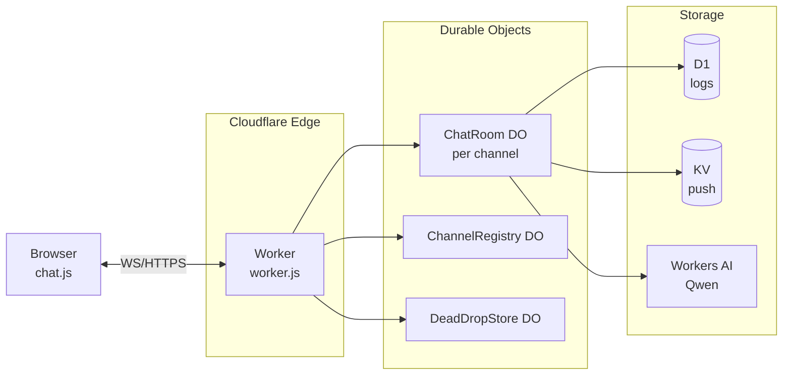

# Anonymous Chat

> **Cloudflare Workers 기반 익명 실시간 채팅 플랫폼**

[](./COMMERCIAL_LICENSE.md)
[](./SECURITY.md)
[](./docs/DEVELOPMENT.md)

Cloudflare Workers · Durable Objects · D1 · Workers AI로 구현된 익명 채팅 서비스입니다.
회원가입 없이 닉네임만으로 즉시 참여하며, **12시간 후 모든 메시지는 자동 소멸**합니다.

---

## 목차

1. [주요 기능](#주요-기능)
2. [기술 스택](#기술-스택)
3. [빠른 시작](#빠른-시작)
4. [프로젝트 구조](#프로젝트-구조)
5. [아키텍처](#아키텍처)
6. [보안](#보안)
7. [개발 명령어](#개발-명령어)
8. [문서 인덱스](#문서-인덱스)

---

## 주요 기능

### 사용자 기능

| 기능 | 설명 |
|---|---|
| 즉시 입장 | 회원가입 없이 닉네임만으로 시작 |
| 실시간 메시징 | WebSocket 기반 즉시 전송 |
| 7가지 테마 | dark · light · midnight · amethyst · sunset · sakura · evernight |
| 메시지 반응 | 6종 이모지 (더블클릭 자동 좋아요) |
| 메시지 답장 | 원본 미리보기 + 비밀 메시지(Dead Drop) 옵션 |
| 파일 공유 | 이미지/비디오/오디오/문서, 최대 **100MB** |
| AI 요약 | `/summary` · `/topic` · `/mood` · `/conflict` 4가지 모드 |
| 메시지 검색 | 키워드 + 태그(`#images` · `#files` · `#code` · `#url`) |
| 링크 프리뷰 | OG 태그 자동 파싱 + 보안 헤더 분석 |
| 코드 하이라이팅 | Prism.js + highlight.js 자동 감지 |
| 다중 채널 | 주제별 독립 채팅방 |
| 공지사항 | 일반/긴급 공지 + 스케줄링 |
| 푸시 알림 | VAPID Web Push + FCM |
| PWA | 홈 화면 추가 · 오프라인 셸 · 공유 대상 |

### 관리자 기능

| 기능 | 설명 |
|---|---|
| 메시지 관리 | 수정 · 삭제 · 전체 삭제 |
| 사용자 차단 | IP + SessionID 이중 (시간/영구) |
| 공지사항 관리 | 발송 · 수정 · 삭제 · 긴급 · 만료 |
| 채널 관리 | 목록 · 상세 · 강제 삭제 |
| 감사 로그 | D1 영구 저장 · 필터링 · CSV 내보내기 |
| 오류 추적 | 자동 수집 · 다운로드 · 초기화 |
| 로그인 기록 | 성공/실패/차단/로그아웃 |

### 보안 기능

| 기능 | 설명 |
|---|---|
| HMAC 메시지 서명 | 클라이언트 → 서버 메시지 변조 방지 |
| HMAC 인증 토큰 | HMAC-signed base64 (JWT 아님) |
| Rate Limiting | 전역 + 엔드포인트별 + 사용자별 다층 |
| Cloudflare Turnstile | 봇 방지 |
| 보안 헤더 | CSP · HSTS · COOP · COEP |
| Dead Drop | 30분 TTL · 1회 읽기 후 영구 삭제 |
| 자동 소멸 | 메시지 12시간 · 차단 자동 만료 |

---

## 기술 스택

| 영역 | 기술 |
|---|---|
| **런타임** | Cloudflare Workers + Pages Functions |
| **상태** | Durable Objects (3개: `ChatRoom`, `ChannelRegistry`, `DeadDropStore`) |
| **DB** | Cloudflare D1 (로그) · KV (푸시 구독, 임시 상태) |
| **AI** | Workers AI · Qwen 3 30B-A3B · Qwen 1.5 7B fallback |
| **푸시** | Web Push (VAPID) + FCM v1 |
| **빌드** | esbuild (`chat.bundle.js`, `admin.bundle.js`) |
| **테스트** | Vitest (57 cases) |
| **린팅** | ESLint + Prettier |
| **프론트** | 바닐라 JS (모듈식) · CSS Custom Properties 테마 · Tailwind(빌드) |

---

## 빠른 시작

### 1단계: 요구사항

- Node.js **18+**
- Cloudflare 계정
- Wrangler CLI (`npm install -g wrangler`)

### 2단계: 설치

```bash
git clone <repo>
cd Anonymous_Chat
npm install
cp .dev.vars.example .dev.vars
```

### 3단계: 개발 서버

```bash
npm run dev
# → http://localhost:8788
```

### 4단계: 빌드 & 검증

```bash
npm run build      # 클라이언트 번들 (esbuild)
npm test           # 57개 유닛 테스트
npm run lint       # ESLint
```

### 5단계: 배포

자세한 내용: [docs/DEPLOYMENT.md](./docs/DEPLOYMENT.md)

```bash
wrangler pages deploy public
wrangler d1 create anonymous-chat-db
wrangler d1 migrations apply anonymous-chat-db
```

---

## 프로젝트 구조

```
.
├── src/                          # Worker (서버)
│   ├── worker.js                 # 메인 라우터 (374줄)
│   ├── schema.js                 # JSDoc 타입 정의
│   ├── config/                   # 상수/설정
│   ├── handlers/                 # HTTP 핸들러
│   ├── durable-objects/          # 3개 DO 클래스
│   │   ├── ChatRoom.js           # WebSocket 채팅 (1080줄)
│   │   ├── ChannelRegistry.js    # 채널 메타데이터
│   │   ├── DeadDropStore.js      # 비밀 메시지
│   │   └── chat-room/            # ChatRoom 보조
│   ├── utils/                    # 유틸 (validate, errors, ...)
│   └── middleware/               # 인증 미들웨어
│
├── public/                       # 정적 자산 + 클라이언트
│   ├── index.html                # 메인 채팅
│   ├── administrator.html        # 관리자 대시보드
│   ├── announcements.html        # 공지 히스토리
│   ├── help.html                 # 사용 가이드
│   ├── privacy.html              # 개인정보처리방침
│   ├── sw.js                     # Service Worker
│   ├── manifest.json             # PWA 매니페스트
│   ├── _headers                  # 보안 헤더
│   ├── js/                       # 클라이언트 모듈
│   │   ├── chat.js               # 메인 (1023줄)
│   │   ├── ui.js + ui-*.js       # UI 매니저 + 5 mixin
│   │   ├── admin.js + admin-*.js # 관리자 + 8 helper
│   │   ├── api-client.js         # fetch wrapper
│   │   ├── websocket.js          # WS 매니저
│   │   ├── session.js            # 세션/닉네임
│   │   ├── theme.js              # 7 테마
│   │   ├── file-upload.js        # 업로드 (100MB)
│   │   ├── search.js             # 검색
│   │   ├── push-manager.js       # VAPID/FCM
│   │   ├── turnstile.js          # Cloudflare Turnstile
│   │   ├── og-preview.js         # OG 카드
│   │   ├── security-headers.js   # Kalpha API
│   │   ├── dead-drop.js          # 비밀 메시지
│   │   ├── sakura.js             # 벚꽃 파티클
│   │   ├── evernight.js          # GIF 파티클
│   │   ├── code-highlight.js     # Prism + highlight.js
│   │   └── utils.js              # 공통 유틸
│   └── css/                      # 테마 + 애니메이션
│
├── test/                         # Vitest 57 cases
├── migrations/                   # D1 스키마
├── functions/                    # Pages Functions 브리지
├── docs/                         # 상세 문서
└── wrangler.toml                 # Cloudflare 설정
```

---

## 아키텍처

자세한 내용: [docs/ARCHITECTURE.md](./docs/ARCHITECTURE.md)


```mermaid
flowchart LR
    Browser[Browser<br/>chat.js]

    subgraph Edge["Cloudflare Edge"]
        Worker[Worker<br/>worker.js]
    end

    subgraph DOs["Durable Objects"]
        ChatRoom[ChatRoom DO<br/>per channel]
        ChannelReg[ChannelRegistry DO]
        DeadDrop[DeadDropStore DO]
    end

    subgraph Storage["Storage"]
        D1[(D1<br/>logs)]
        KV[(KV<br/>push)]
        AI[Workers AI<br/>Qwen]
    end

    Browser <-->|WS/HTTPS| Worker
    Worker --> ChatRoom
    Worker --> ChannelReg
    Worker --> DeadDrop
    ChatRoom --> D1
    ChatRoom --> KV
    ChatRoom --> AI
```

### 핵심 결정

| 결정 | 이유 |
|---|---|
| **WebSocket은 DO에서 직접 처리** | Sticky session 보장 |
| **HMAC-SHA256 메시지 서명** | 클라이언트 → DO 메시지 변조 방지 |
| **`X-Admin-Internal-Token`** | Worker ↔ DO 내부 통신 (SSRF 방지) |
| **채널 = 별도 DO 인스턴스** | 메타데이터는 `ChannelRegistry`에 |

---

## 보안

전체 체크리스트: [docs/SECURITY.md](./docs/SECURITY.md) · [SECURITY.md](./SECURITY.md)

| 통제 | 설명 |
|---|---|
| D1 파라미터 바인딩 | SQL Injection 방지 |
| 상수 시간 비교 | 타이밍 공격 방지 |
| 입력 sanitization | `sanitizeInput`, `escapeHtml` |
| 메시지 서명 검증 | HMAC-SHA256 |
| Rate Limiting | 다층 적용 |
| 보안 헤더 | CSP · HSTS · COOP · COEP |
| Cloudflare Turnstile | 봇 방지 |
| SSRF 방지 | 내부 토큰 |

---

## 개발 명령어

```bash
npm run dev      # wrangler dev (로컬 Workers)
npm test         # vitest run
npm run lint     # eslint
npm run build    # esbuild 클라이언트 번들
npm run deploy   # 빌드 + wrangler pages deploy
```

자세한 내용: [docs/DEVELOPMENT.md](./docs/DEVELOPMENT.md)

---

## 기여

기여 절차: [CONTRIBUTING.md](./CONTRIBUTING.md)

---

## 라이선스

상업적 용도 포함 모든 권리 보유.
자세한 내용: [COMMERCIAL_LICENSE.md](./COMMERCIAL_LICENSE.md)

**문의**: dev@kalpha.kr

---

## 문서 인덱스

| 문서 | 용도 |
|---|---|
| [CHANGELOG.md](./CHANGELOG.md) | 변경 이력 |
| [FEATURE_IDEAS.md](./FEATURE_IDEAS.md) | 기능 아이디어 + 구현 상태 |
| [CONTRIBUTING.md](./CONTRIBUTING.md) | 기여 가이드 |
| [SECURITY.md](./SECURITY.md) | 보안 정책 |
| [COMMERCIAL_LICENSE.md](./COMMERCIAL_LICENSE.md) | 라이선스 |
| [docs/ARCHITECTURE.md](./docs/ARCHITECTURE.md) | 아키텍처 |
| [docs/API.md](./docs/API.md) | API 명세 |
| [docs/SECURITY.md](./docs/SECURITY.md) | 보안 체크리스트 |
| [docs/DEPLOYMENT.md](./docs/DEPLOYMENT.md) | 배포 가이드 |
| [docs/DEVELOPMENT.md](./docs/DEVELOPMENT.md) | 개발 가이드 |
