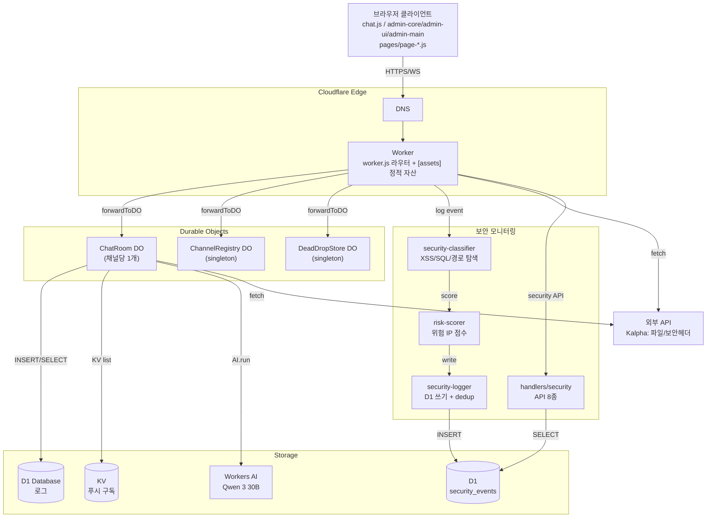
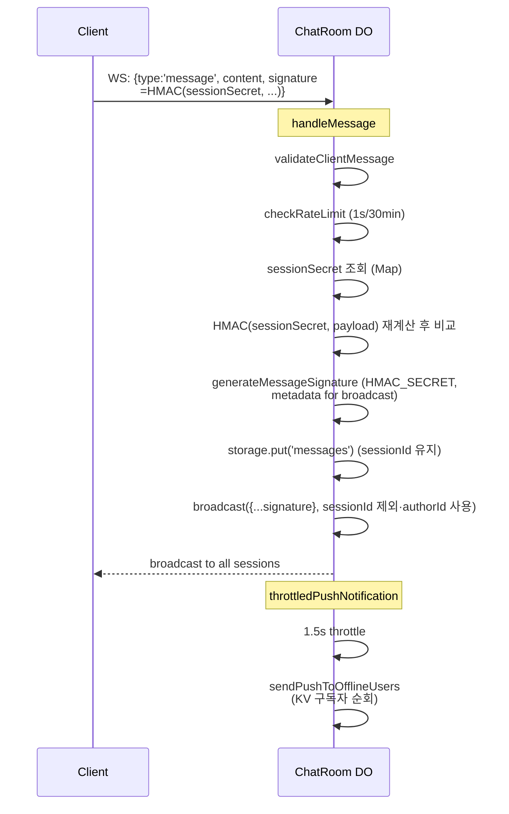
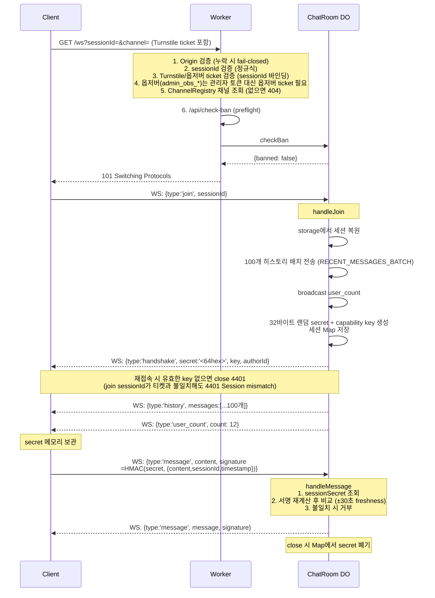
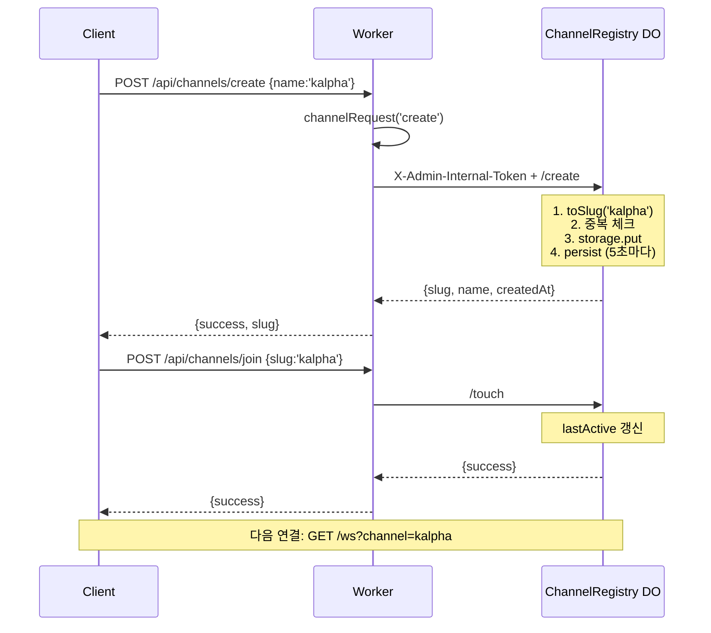
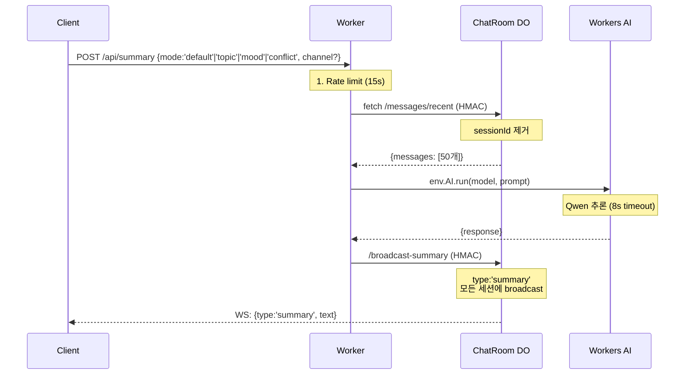
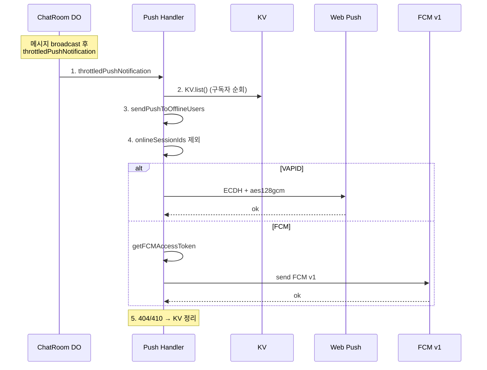

# 아키텍처

> Anonymous Chat의 시스템 아키텍처 및 데이터 흐름

---

## 목차

1. [시스템 개요](#시스템-개요)
2. [컴포넌트](#컴포넌트)
3. [데이터 흐름](#데이터-흐름)
4. [보안 경계](#보안-경계)
5. [빌드 파이프라인](#빌드-파이프라인)
6. [성능 특성](#성능-특성)
7. [확장 포인트](#확장-포인트)

---

## 시스템 개요



---

## 컴포넌트

### 1. Worker (`src/worker.js`, 543줄)

Cloudflare Workers 진입점 (정적 자산은 `[assets]` 바인딩으로 서빙). HTTP 라우팅, WebSocket 업그레이드, 정적 자산 폴백 처리.

**라우트 테이블**

| 분류 | 개수 | 경로 |
|---|---|---|
| 공개 엔드포인트 | 22 | `/api/*`, `/ws`, `/metrics`, `/health` |
| 관리자 엔드포인트 | 32 | `/api/admin/*` (라우트별 허용 메서드 명시) |
| SPA fallback | – | 미매칭 → `/index.html` |

**주요 헬퍼**

| 함수 | 책임 |
|---|---|
| `matchRoute()` | 선언적 라우트 매칭 (메서드/메서드 배열 지원) |
| `handleChannelCreate` / `handleChannelJoin` / `handleChannelList` | 채널 생성/참가/목록 핸들러 |
| `serveStaticAssets()` | ASSETS 바인딩 + SPA fallback |
| `checkRateLimit()` | Lazy-init rate-limiter (Workers 호환) |

---

### 2. ChatRoom Durable Object (`src/durable-objects/ChatRoom.js`, 1642줄)

핵심 WebSocket 핸들러. 채널당 1개 인스턴스 (메인룸 1 + 채널 N).

**책임**

| 영역 | 설명 |
|---|---|
| 세션 관리 | `sessions` Map, `ipConnections` Map |
| 메시지 저장 | DO Storage 12시간, 최대 2000개 (96KiB 바이트 캡) |
| 차단 | IP + SessionID |
| 공지 | 일반/긴급 + 스케줄링 |
| 반응 | 이모지 토글 |
| 푸시 | 오프라인 사용자 |
| AI 요약 | Workers AI 호출 |
| 자동 정리 | 마지막 퇴장 시 DO alarm 예약 → 빈 채널 자체 삭제 (10분 TTL) |

**보조 모듈**

| 파일 | 줄 | 책임 |
|---|---|---|
| `chat-room/admin.js` | 1156 | 19개 `/admin/*` 라우트 (ban-ip, verify-session 포함) |
| `chat-room/messages.js` | 218 | 검증, 검색, AI sanitization |
| `chat-room/announcements.js` | 5 | `isEmergencyActive` 헬퍼 |

**WebSocket 메시지 타입**

| 방향 | 개수 | 타입 |
|---|---|---|
| Inbound | 7 | `ping`, `join`, `message`, `edit`, `delete`, `reaction`, `typing` |
| Outbound | 19 | `handshake`, `pong`, `banned`, `history`, `announcement`, `system`, `error`, `message`, `message_edited`, `message_deleted`, `message_reaction`, `typing`, `user_count`, `emergency_cleared`, `summary`, `kicked`, `all_messages_deleted`, `admin_event`, `channel_deleted` |

---

### 3. ChannelRegistry Durable Object (`src/durable-objects/ChannelRegistry.js`, 411줄)

채널 메타데이터 싱글톤. slug → 채널 정보 매핑.

**책임**
- 채널 생성/조회/삭제
- `lastActive` 갱신
- 빈 채널 자동 정리 (alarm 전용 — fetch 시 스윕 없음, 최소 5분 간격, 삭제 전 activeConnections 0 확인)
- 관리자 채널 목록/강제 삭제

---

### 4. DeadDropStore Durable Object (`src/durable-objects/DeadDropStore.js`, 183줄)

1회성 비밀 메시지 싱글톤.

**특징**
- 30분 TTL
- 1회 읽기 후 영구 삭제
- 10,000자 제한
- 404/410으로 만료/소진 구분
- DO alarm 기반 만료 정리 (저장 시 가장 이른 만료로 재예약, alarm에서 정리 후 재예약/삭제)

---

### 5. 핸들러 (`src/handlers/`)

| 파일 | 줄 | 책임 |
|---|---|---|
| `admin.js` | 625 | 24개 핸들러 (login + withAuth 23종, observer-ticket 포함) |
| `websocket.js` | 133 | WebSocket 업그레이드 + 옵저버 티켓/차단 사전 확인 |
| `push.js` | 351 | VAPID/FCM 구독 관리 + 발송 |
| `summary.js` | 216 | Workers AI 요약 (4 모드, 15초 레이트리밋) |
| `preview.js` | 279 | OG 태그 스크래퍼 (Edge cache 1시간, SSRF denylist) |
| `turnstile.js` | 183 | Cloudflare Turnstile 검증 + Turnstile/옵저버 티켓 발급·검증 |
| `health.js` | 17 | `/health`, `/metrics` |

---

### 6. 미들웨어/유틸

| 파일 | 책임 |
|---|---|
| `middleware/auth.js` | opaque KV 토큰 발급/검증 (12시간 슬라이딩), Rate limit |
| `utils/do.js` | DO 라우팅 (`getChatRoom`, `getChannelRoom`, `forwardToDO`) |
| `utils/validate.js` | 메시지/채널/닉네임/세션/Dead Drop 검증 |
| `utils/errors.js` | `jsonError`, `jsonSuccess`, `textError`, `emptyResponse` |
| `utils/helpers.js` | `sanitizeInput`, HMAC 헬퍼, `safeJson` |
| `utils/rate-limiter.js` | 메모리 기반 윈도우 카운터 |
| `utils/security.js` | `constantTimeCompare`, `isAllowedOrigin` |
| `utils/security-classifier.js` | XSS/SQL/경로 탐색 패턴 매칭 (22종 이벤트 분류) |
| `utils/risk-scorer.js` | 시간 가중치 + 카테고리 다양성 기반 위험 IP 점수 |
| `utils/security-logger.js` | D1 security_events 쓰기 + 60초 dedup + 90일 정리 |
| `utils/logger.js` | D1 admin/audit/error 로거 + security event re-export |
| `utils/web-push.js` | VAPID JWT + RFC 8291 암호화 |
| `utils/fcm-auth.js` | Google OAuth JWT for FCM v1 |
| `config/constants.js` | 모든 매직 넘버 (서버+클라이언트 공유) |
| `config/cors.js` | CORS 헤더 |
| `constants/security-events.js` | 22종 보안 이벤트 정의 (카테고리/심각도/점수) |

---

## 데이터 흐름

### 1. 메시지 전송 (가장 빈번한 경로)



### 2. WebSocket 핸드셰이크 (Ephemeral Token)



### 3. 채널 생성/참가



### 4. AI 요약



### 5. 푸시 알림 (오프라인 사용자)



---

## 보안 경계

### 인증 토큰 종류

| 종류 | 형식 | 위치 | 특징 |
|---|---|---|---|
| **관리자 토큰** | opaque 32바이트 랜덤 값 (KV `token:<t>`) | `auth.js` | 12시간 슬라이딩 TTL, 로그아웃 시 KV 폐기, 401 자동 로그아웃 |
| **옵저버 티켓** | `HMAC(observer:<sessionId>:<ts>)` | `handlers/admin.js` + `handlers/turnstile.js` | `POST /api/admin/observer-ticket`이 5분 TTL로 발급, `/ws`가 검증 (관리자 토큰 URL 미노출) |
| **내부 토큰** | `X-Admin-Internal-Token` | `worker.js` ↔ DO | SSRF 방지 |
| **메시지 서명 (Ephemeral Token)** | `HMAC(sessionSecret, JSON.stringify({content, sessionId, timestamp}))` | `ChatRoom.js` + `signature.js` | 32바이트 세션별 secret + capability key(재입장 회전), authorId(16hex)로 sessionId 대체, ±30초 freshness, close/4401 시 폐기 |

### Rate Limiting

| 계층 | 위치 | 규칙 |
|---|---|---|
| **전역** | `src/utils/rate-limiter.js` | per-worker 인메모리, 5분 cleanup |
| **엔드포인트별** | `API_RATE_LIMIT` 상수 | metrics, health, config, turnstile, upload, push, check-ban, logs/error, preview, summary, secret-store/read, announcements/emergency, channels, search, vapid, ws |
| **관리자 API** | `src/worker.js` (`API_RATE_LIMIT.ADMIN`) | `/api/admin/*` IP당 120회/분 |
| **사용자별** | ChatRoom | 1초 쿨다운, 분당 30개 슬라이딩 윈도우 (반응 3초, 타이핑 시작 2초 스로틀) |
| **관리자 로그인** | `checkRateLimit`/`incrementRateLimit` | 5회/5분 차단 |

### 입력 검증

| 입력 | 함수 | 규칙 |
|---|---|---|
| 메시지 | `validateClientMessage` | type별 분기 |
| Dead Drop | `validateDeadDropMessage` | ≤10,000자 |
| 채널명 | `validateChannelName` | ≤20자, trim |
| 닉네임 | `validateNickname` | ≤12자, trim |
| sessionId | `validateSessionId` | `[a-zA-Z0-9_-]{1,200}` |
| 파일 | `validateFileInfo` | url/filename/filetype 길이 |
| 상수 | `sanitizeInput` | 제어문자 제거 + 줄바꿈 정규화 |

### 데이터 보존

| 데이터 | 보존 | 자동 삭제 |
|---|---|---|
| 메시지 | 12시간 (메모리 + DO Storage) | ✅ (5분 cleanup) |
| 공지 | 영구, 히스토리 최대 100개 (메모리 + DO Storage) | 수동 |
| Dead Drop | 30분 TTL, 1회 읽기 후 삭제 | ✅ TTL + DO alarm |
| 감사 로그 | D1 (audit_logs, 90일) | ✅ 주기적 강제 스윕(10회 중 1회) + 확률적 |
| 관리자 로그 | D1 (admin_activity_logs, 30일) | ✅ 주기적 강제 스윕(10회 중 1회) + 확률적 |
| 오류 로그 | D1 (error_logs, 30일) | ✅ 주기적 강제 스윕(10회 중 1회) + 확률적 |
| 보안 이벤트 | D1 (security_events, 90일 보존) | ✅ 주기적 강제 스윕(10회 중 1회) + 확률적 |
| 푸시 구독 | 30일 TTL (KV) | ✅ TTL |
| 차단 | 시간 설정에 따라 만료 (영구 옵션) | ✅ 만료 시 |
| 세션 capability 키 | KV (30분 TTL, 최대 500개) | ✅ TTL (연결 중 세션 키는 축출 제외) |

---

## 빌드 파이프라인

```mermaid
flowchart LR
    subgraph Server["서버"]
        Worker1[src/worker.js<br/>ESM]
        Worker1 --> Runtime[Cloudflare Workers<br/>+ Static Assets (public/)]
    end

    subgraph Client["클라이언트"]
        Chat[public/js/chat.js<br/>+ 30 source modules + 6 page wrappers]
        Admin[public/js/admin-core.js / admin-ui.js / admin-main.js<br/>+ security-center.js + 6 pages]
        TailwindB[tailwind 빌드<br/>45KB]

        Chat -->|esbuild| ChatBundle[chat.bundle.js]
        Admin -->|esbuild| AdminCore[admin-core.bundle.js]
        Admin -->|esbuild| AdminPages[admin-*.bundle.js<br/>+ security-center.bundle.js<br/>10 bundles total]
        Tailwind -.->|교체| TailwindB
    end
```

**클라이언트 번들 참고**: Prism.js는 `code-highlight.js` 엔트리로 로컬 번들링되며, CDN 스크립트를 사용하지 않습니다 (`_headers` CSP `script-src 'self'` 유지).

---

## 성능 특성

| 지표 | 결과 |
|---|---|
| 메시지 히스토리 로딩 | 100개, 500ms → **20ms** (25배, DocumentFragment) |
| 이벤트 리스너 | 메시지당 5-6개 → 컨테이너 5개 (위임) |
| Tailwind | 300KB CDN → **45KB** 빌드 |
| 번들 | 19개 모듈 → **10개** (chat, admin-core, admin-main, 관리자 페이지 6, security-center) |
| WS Reconnect | 지수 백오프, 최대 10회/30s |
| AI Timeout | 8초 + 15초 레이트리밋 |
| OG Cache | 1시간 Edge + 50개 클라이언트 메모리 |
| 푸시 Throttle | 1.5초 (debounce) |

---

## 확장 포인트

| 추가 대상 | 위치 | 절차 |
|---|---|---|
| 새 DO | `src/durable-objects/` | `wrangler.toml` `[[durable_objects.bindings]]` 등록 |
| 새 라우트 | `worker.js` | `routes` 배열에 추가 |
| 새 핸들러 | `src/handlers/` | 모듈 추가, `worker.js`에서 import |
| 새 상수 | `src/config/constants.js` | 서버+클라이언트 공유 |
| 새 테마 | `themes.css` | CSS Custom Properties 추가, `theme.js` `THEMES` 배열에 추가 |
| 새 mixin | `public/js/ui-*.js` | `ui.js` 끝에서 `Object.assign`으로 부착 |
